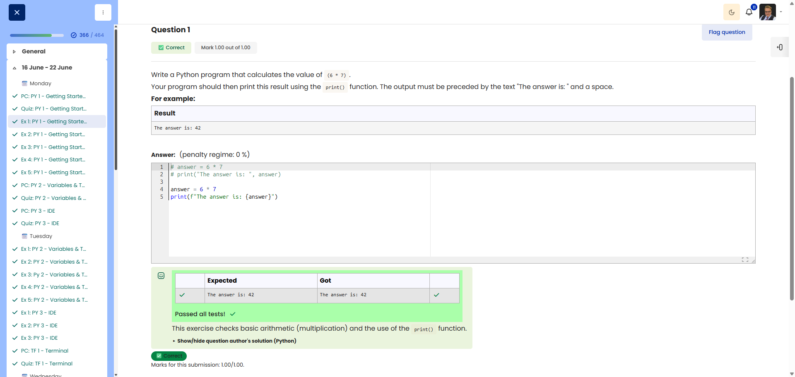

# 🐍 The Answer (Simple Calculation)

**Course:** Cyber Security Analyst - Python Basics | **Date:** 16 June 2025

---

## Task

**Objective:** Calculate `6 * 7` and display the result as formatted text.

**Requirements:**
- Calculate: `6 * 7`
- Output: `Die Antwort lautet: 42`
- Use: `print()` function

---

## Solution

```python
answer = 6 * 7
print(f"Die Antwort lautet: {answer}")
```

**Alternative solutions:**
```python
# With comma separator
answer = 6 * 7
print("Die Antwort lautet:", answer)

# Direct calculation
print(f"Die Antwort lautet: {6 * 7}")
```

---

## Tests

| Input | Expected | Result | ✓ |
|-------|----------|----------|---|
| (none) | `Die Antwort lautet: 42` | `Die Antwort lautet: 42` | ✅ |

---

## Evidence

This evidence was added to the original solution structure. It documents the Cybersteps submission and keeps the original task, solution, tests, and notes intact.

The screenshot shows the course platform marking the submission as correct. The test table shows that the expected output `The answer is: 42` matches the actual output, and the submission received `1.00/1.00`.



**Result:**

| Field | Entry |
|---|---|
| Execution environment | Browser-based course platform / Python exercise |
| Calculation | `6 * 7` |
| Result value | `42` |
| Verified output | `The answer is: 42` |
| Status | Passed |
| Score | 1.00/1.00 |

**Validation:**

- The exercise was marked correct by the course platform.
- The screenshot shows both expected and actual output.
- The screenshot is stored in `screenshots/`.
- The image link uses a relative path.
- No credentials, flags, or fabricated outputs are included.

**Security / Practice Relevance:**

This exercise builds the foundation for small automation scripts: calculate a value, store it in a variable, and produce an exact, reviewer-readable output. That same precision matters later when scripts generate logs, checks, or security reports.

**Screenshots:**


## Notes

- **Concept:** Variable assignment and f-strings
- **f-string:** `f"Text {variable}"` inserts the variable value
- **Alternative:** `print("Text", var)` automatically inserts spaces
- **Tip:** f-strings are the most modern method (Python 3.6+)
