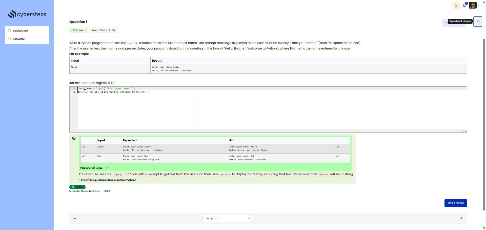

# 🐍 Welcome (user-entered data)

**Course:** Cybersecurity Analyst – Python Basics | **Date:** 16 June 2025

---

## Task

**Objective:** Ask the user for their name and display a personalised greeting.

**Requirements:**
- Prompt: `Enter your name: ` (with a space at the end)
- Output: `Hello, [Name]! Welcome to the world of Python.`
- Use: the `input()` and `print()` functions

---

## Solution

```python
save_name = input("Enter your name: ")
print(f"Hello, {save_name}! Welcome to Python.")
```

**Alternative solutions:**
```python
# Using string concatenation
name = input("Enter your name: ")
print("Hello, " + name + "! Welcome to Python.")

# Using a comma separator (note: extra spaces)
name = input("Enter your name: ")
print("Hello,", name + "! Welcome to Python.")
```

---

## Tests

| Input | Expected | Result | ✓ |
|-------|----------|----------|---|
| `Max` | `Hello, Max! Welcome to Python.` | `Hello, Max! Welcome to Python.` | ✅ |
| `Anna` | `Hello, Anna! Welcome to Python.` | `Hello, Anna! Welcome to Python.` | ✅ |
| `` (empty) | `Hello, ! Welcome to Python.` | `Hello, ! Welcome to Python.` | ✅ |

---

## Evidence

This evidence was added to the original solution structure. It documents the Cybersteps submission and keeps the original task, solution, tests, and notes intact.

The screenshot shows the course platform marking the submission as correct. The test table includes the inputs `Alice` and `Bob`; for both, the expected output matches the actual output. The submission received `1.00/1.00`.



**Result:**

| Field | Entry |
|---|---|
| Execution environment | Browser-based course platform / Python exercise |
| Input function | `input()` |
| Prompt | `Enter your name: ` |
| Verified inputs | `Alice`, `Bob` |
| Verified output | `Hello, [Name]! Welcome to Python.` |
| Status | Passed |
| Score | 1.00/1.00 |

**Validation:**

- The exercise was marked correct by the course platform.
- The screenshot shows expected and actual output for two test inputs.
- The screenshot is stored in `screenshots/`.
- The image link uses a relative path.
- No credentials, flags, or fabricated outputs are included.

**Security / Practice Relevance:**

This exercise introduces user input and formatted output. The same pattern appears in security automation when scripts accept parameters such as usernames, paths, targets, or configuration values and then report clear results.

**Screenshots:**


## Notes

- **Concept:** `input()` always returns a string
- **Important:** Note the spaces in the prompt (`"Enter your name: "`)
- **String f-formatting:** The best method for formatting strings
- **Tip:** `input()` waits for input + Enter
