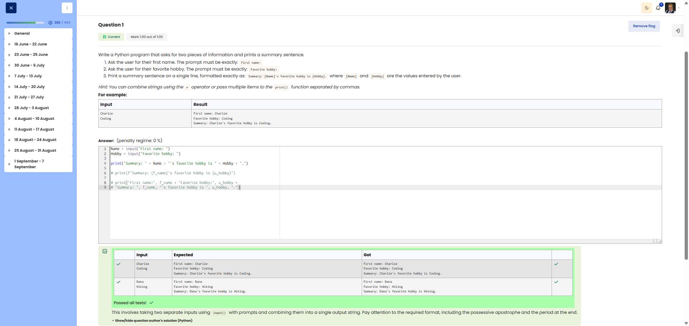

# 🐍 Name and Hobby (Multiple inputs)

**Course:** Cyber Security Analyst - Python Basics | **Date:** 16 June 2025

---

## Task

**Objective:** Prompt the user for two pieces of input and display them as a summary.

**Requirements:**
- Prompt 1: `First name:` (no space at the end)
- Prompt 2: `Favorite hobby:` (no space at the end)
- Output: `Summary: [Name]'s favourite hobby is [Hobby].`
- Use: String concatenation or f-strings

---

## Solution

```python
Name = input("First name: ")
Hobby = input("Favorite hobby: ")
print("Summary: " + Name + "'s favorite hobby is " + Hobby + ".")
```

**Alternative solutions:**
```python
# Using f-strings (recommended)
name = input("First name: ")
hobby = input("Favourite hobby: ")
print(f"Summary: {name}'s favourite hobby is {hobby}.")

# Using .format()
name = input("First name: ")
hobby = input("Favourite hobby: ")
print("Summary: {}'s favourite hobby is {}.".format(name, hobby))
```

---

## Tests

| Input | Expected | Result | ✓ |
|-------|----------|----------|---|
| `Max`, `Gaming` | `Summary: Max's favourite hobby is Gaming.` | `Summary: Max's favourite hobby is Gaming.` | ✅ |
| `Anna`, `Reading` | `Summary: Anna's favourite hobby is Reading.` | `Summary: Anna's favourite hobby is Reading.` | ✅ |

---

## Evidence

This evidence was added to the original solution structure. It documents the Cybersteps submission and keeps the original task, solution, tests, and notes intact.

The screenshot shows the course platform marking the submission as correct. The test table includes the input pairs `Charlie` / `Coding` and `Dana` / `Hiking`; for both, the expected output matches the actual output. The submission received `1.00/1.00`.



**Result:**

| Field | Entry |
|---|---|
| Execution environment | Browser-based course platform / Python exercise |
| Input functions | `input()` for name and hobby |
| Prompt 1 | `First name:` |
| Prompt 2 | `Favorite hobby:` |
| Verified inputs | `Charlie` / `Coding`, `Dana` / `Hiking` |
| Verified output | `Summary: [Name]'s favorite hobby is [Hobby].` |
| Status | Passed |
| Score | 1.00/1.00 |

**Validation:**

- The exercise was marked correct by the course platform.
- The screenshot shows expected and actual output for two test cases.
- The screenshot is stored in `screenshots/`.
- The image link uses a relative path.
- No credentials, flags, or fabricated outputs are included.

**Security / Practice Relevance:**

This exercise practices collecting multiple input values, storing them, and combining them into one readable output. The same pattern appears in automation scripts that accept several parameters and report the resulting context clearly.

**Screenshots:**


## Notes

- **Concept:** String concatenation using `+`
- **Important:** `+` does NOT automatically insert spaces
- **Apostrophe:** `'s` must be included manually in the string
- **Best practice:** Use lowercase for variable names (`name` instead of `Name`)
- **Tip:** f-strings are more readable than `+` concatenation
