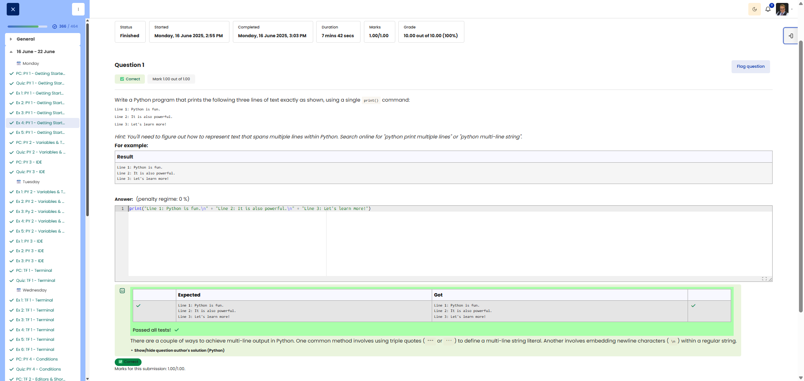

# 🐍 Multiline Print (Multi-line output)

**Course:** Cyber Security Analyst - Python Basics | **Date:** 16 June 2025

---

## Task

**Objective:** Output three lines of text using a single `print()` command.

**Requirements:**
- Only ONE `print()` command
- Output exactly:
  ```
  Line 1: Python is fun.
  Line 2: It is also powerful.
  Line 3: Let's learn more!
  ```

---

## Solution

```python
print("Line 1: Python is fun.\n" + "Line 2: It is also powerful.\n" + "Line 3: Let's learn more!")
```

**Alternative solutions:**
```python
# Using triple quotes (multi-line string) - recommended
print("""Line 1: Python is fun.
Line 2: It is also powerful.
Line 3: Let's learn more!""")

# Only with \n (without +)
print("Line 1: Python is fun.\nLine 2: It is also powerful.\nLine 3: Let's learn more!")

# With escape sequence for line break
print("Line 1: Python is fun.\n"
      "Line 2: It is also powerful.\n"
      "Line 3: Let's learn more!")
```

---

## Tests

| Input | Expected | Result | ✓ |
|-------|----------|----------|---|
| (none) | 3 lines as above | 3 lines as above | ✅ |

**Output:**
```
Line 1: Python is fun.
Line 2: It is also powerful.
Line 3: Let's learn more!
```

---

## Evidence

This evidence was added to the original solution structure. It documents the Cybersteps submission and keeps the original task, solution, tests, and notes intact.

The screenshot shows the course platform marking the submission as correct. The Expected/Got table confirms that all three output lines, including line breaks, match exactly. The submission received `1.00/1.00`.



**Result:**

| Field | Entry |
|---|---|
| Execution environment | Browser-based course platform / Python exercise |
| Core technique | One `print()` with `\n` line breaks |
| Verified output | Three exact text lines |
| Status | Passed |
| Score | 1.00/1.00 |

**Validation:**

- The exercise was marked correct by the course platform.
- The screenshot shows expected and actual output.
- The screenshot is stored in `screenshots/`.
- The image link uses a relative path.
- No credentials, flags, or fabricated outputs are included.

**Security / Practice Relevance:**

This exercise practices deliberate multi-line output formatting. That matters when scripts need to produce readable terminal output, simple reports, or structured operator messages.

**Screenshots:**


## Notes

- **Concept:** Escape sequences and multi-line strings
- **`\n`:** Newline (line break)
- **Triple quotes:** `"""` or `'''` for multi-line strings
- **Other escape sequences:**
  - `\t` = Tab
  - `\\` = Backslash
  - `\'` = Apostrophe
  - `\"` = Double quotation mark
- **Tip:** Triple quotes are more readable for longer texts
