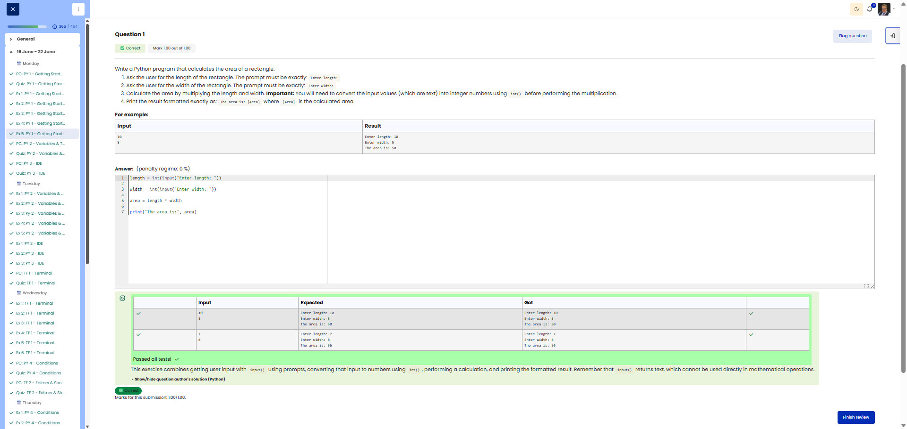

# 🐍 Rectangle Area (Type Conversion)

**Course:** Cyber Security Analyst - Python Basics | **Date:** 16 June 2025

---

## Task

**Objective:** Calculate the area of a rectangle based on user input.

**Requirements:**
- Prompt 1: `Enter length:`
- Prompt 2: `Enter width:`
- Calculation: `Area = Length × Width`
- Output: `The area is: [Area]`
- Important: Use `int()` for type conversion

---

## Solution

```python
length = int(input("Enter length: "))
width = int(input("Enter width: "))
area = length * width
print("The area is:", area)
```

**Alternative solutions:**
```python
# Using f-strings
length = int(input("Enter length: "))
width = int(input("Enter width: "))
print(f"The area is: {length * width}")

# Using float for decimal numbers
length = float(input("Enter length: "))
width = float(input("Enter width: "))
area = length * width
print("The area is:", area)

# With separate conversion
length_str = input("Enter length: ")
width_str = input("Enter width: ")
length = int(length_str)
width = int(width_str)
area = length * width
print("The area is:", area)
```

---

## Tests

| Length | Width | Expected | Result | ✓ |
|--------|-------|----------|----------|---|
| `5` | `4` | `The area is: 20` | `The area is: 20` | ✅ |
| `10` | `10` | `The area is: 100` | `The area is: 100` | ✅ |
| `7` | `3` | `The area is: 21` | `The area is: 21` | ✅ |

---

## Evidence

This evidence was added to the original solution structure. It documents the Cybersteps submission and keeps the original task, solution, tests, and notes intact.

The screenshot shows the course platform marking the submission as correct. The test table includes the input pairs `10` / `5` and `7` / `8`; for both, the expected output matches the actual output. The submission received `1.00/1.00`.



**Result:**

| Field | Entry |
|---|---|
| Execution environment | Browser-based course platform / Python exercise |
| Input functions | `input()` for length and width |
| Type conversion | `int()` |
| Calculation | `length * width` |
| Verified inputs | `10` / `5`, `7` / `8` |
| Verified outputs | `The area is: 50`, `The area is: 56` |
| Status | Passed |
| Score | 1.00/1.00 |

**Validation:**

- The exercise was marked correct by the course platform.
- The screenshot shows expected and actual output for two test cases.
- The screenshot is stored in `screenshots/`.
- The image link uses a relative path.
- No credentials, flags, or fabricated outputs are included.

**Security / Practice Relevance:**

This exercise shows why user input needs explicit type conversion before mathematical operations. That matters in automation scripts where text input must become numbers before calculations, comparisons, thresholds, or scoring can work reliably.

## Notes

- **Concept:** Type conversion (Type Casting)
- **Important:** `input()` ALWAYS returns a string!
- **`int()`:** Converts a string to an integer
- **`float()`:** Converts a string to a floating-point number
- **Error without `int()`:** `"5" * "4"` → TypeError!
- **String multiplication:** `"5" * 4` → `"5555"` (repetition)

**Type conversion functions:**

| Function | Description | Example |
|----------|--------------|----------|
| `int()` | String → Integer | `int("42")` → `42` |
| `float()` | String → Decimal | `float("3.14")` → `3.14` |
| `str()` | Number → String | `str(42)` → `"42"` |
