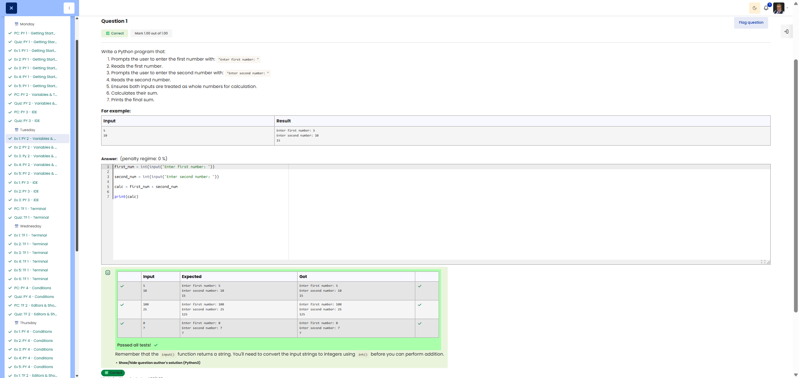

# 🐍 Sum Calculator (Adding two numbers)

**Course:** Cyber Security Analyst - Python Basics | **Date:** 17 June 2025

---

## Task

**Objective:** Read two numbers from the user and calculate their sum.

**Requirements:**
- Prompt 1: `Enter first number: `
- Prompt 2: `Enter second number: `
- Calculation: Sum of the two numbers
- Treat inputs as integers (`int`)

---

## Solution

```python
first_num = int(input("Enter first number: "))
second_num = int(input("Enter second number: "))
calc = first_num + second_num
print(calc)
```

**Alternative solutions:**
```python
# With f-string output
first_num = int(input("Enter first number: "))
second_num = int(input("Enter second number: "))
print(f"The sum is: {first_num + second_num}")

# Compact (not recommended for readability)
print(int(input("Enter first number: ")) + int(input("Enter second number: ")))
```

---

## Tests

| Input 1 | Input 2 | Expected | Result | ✓ |
|---------|---------|-- --------|----------|---|
| `5` | `3` | `8` | `8` | ✅ |
| `10` | `20` | `30` | `30` | ✅ |
| `-5` | `5` | `0` | `0` | ✅ |
| `0` | `0` | `0` | `0` | ✅ |

---

## Evidence

This evidence was added to the original solution structure. It documents the Cybersteps submission and keeps the original task, solution, tests, and notes intact.

The screenshot shows the course platform marking the submission as correct. The test table includes the input pairs `5` / `10`, `100` / `25`, and `0` / `7`; for all cases, the expected output matches the actual output. The submission received `1.00/1.00`.



**Result:**

| Field | Entry |
|---|---|
| Execution environment | Browser-based course platform / Python exercise |
| Input functions | `input()` for two numbers |
| Type conversion | `int()` |
| Calculation | `first_num + second_num` |
| Verified inputs | `5` / `10`, `100` / `25`, `0` / `7` |
| Verified outputs | `15`, `125`, `7` |
| Status | Passed |
| Score | 1.00/1.00 |

**Validation:**

- The exercise was marked correct by the course platform.
- The screenshot shows expected and actual output for three test cases.
- The screenshot is stored in `screenshots/`.
- The image link uses a relative path.
- No credentials, flags, or fabricated outputs are included.

**Security / Practice Relevance:**

This exercise reinforces explicit type conversion before calculations. In automation and security scripts, text input often needs to become numeric data before thresholds, counters, risk scores, or calculations can be handled correctly.

## Notes

- **Concept:** Type conversion with `int()` and arithmetic operations
- **Important:** Without `int()`, `"5" + "3"` would equal `"53"` (string concatenation!)
- **Arithmetic operators:**
  - `+` Addition
  - `-` Subtraction
  - `*` Multiplication
  - `/` Division (result: float)
  - `//` Integer division
  - `%` Modulo (remainder)
  - `**` Exponentiation
