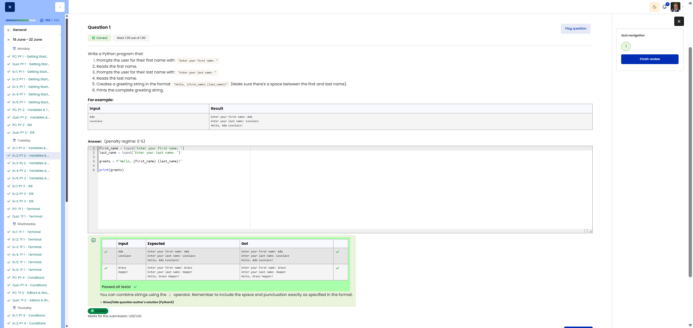

# 🐍 Full Name Greeting (First Name and Surname)

**Course:** Cyber Security Analyst - Python Basics | **Date:** 17 June 2025

---

## Task

**Objective:** Read in the first name and surname and display a personalised greeting.

**Requirements:**
- Prompt 1: `Enter your first name: `
- Prompt 2: `Enter your last name: `
- Output: `Hello, [first_name] [last_name]!`
- Ensure there is a space between the first name and surname

---

## Solution

```python
first_name = input("Enter your first name: ")
last_name = input("Enter your last name: ")
greets = f"Hello, {first_name} {last_name}!"
print(greets)
```

**Alternative solutions:**
```python
# Using string concatenation
first_name = input("Enter your first name: ")
last_name = input("Enter your last name: ")
print("Hello, " + first_name + " " + last_name + "!")

# Compact with f-strings
first_name = input("Enter your first name: ")
last_name = input("Enter your last name: ")
print(f"Hello, {first_name} {last_name}!")

# Using .format()
first_name = input("Enter your first name: ")
last_name = input("Enter your last name: ")
print("Hello, {} {}!".format(first_name, last_name))
```

---

## Tests

| First Name | Last Name | Expected | Result | ✓ |
|------------|-----------|----------|----------|---|
| `Max` | `Mustermann` | `Hello, Max Mustermann!` | `Hello, Max Mustermann!` | ✅ |
| `Anna` | `Schmidt` | `Hello, Anna Schmidt!` | `Hello, Anna Schmidt!` | ✅ |
| `John` | `Doe` | `Hello, John Doe!` | `Hello, John Doe!` | ✅ |

---

## Evidence

This evidence was added to the original solution structure. It documents the Cybersteps submission and keeps the original task, solution, tests, and notes intact.

The screenshot shows the course platform marking the submission as correct. The test table includes `Ada` / `Lovelace` and `Grace` / `Hopper`; for both cases, the expected output matches the actual output. The submission received `1.00/1.00`.



**Result:**

| Field | Entry |
|---|---|
| Execution environment | Browser-based course platform / Python exercise |
| Inputs | First name and last name |
| Verified inputs | `Ada` / `Lovelace`, `Grace` / `Hopper` |
| Verified output | `Hello, [first_name] [last_name]!` |
| Status | Passed |
| Score | 1.00/1.00 |

**Validation:**

- The exercise was marked correct by the course platform.
- The screenshot shows expected and actual output for two test cases.
- The screenshot is stored in `screenshots/`.
- The image link uses a relative path.
- No credentials, flags, or fabricated outputs are included.

**Security / Practice Relevance:**

This exercise practices combining separate input values into a precise output string. That same pattern appears in automation scripts that produce readable user, asset, or report labels.

## Notes

- **Concept:** Combining multiple inputs with f-strings
- **Important:** Space in the f-string between `{first_name}` and `{last_name}`
- **Best practice:** Choose descriptive variable names (`first_name` instead of `fn`)
- **Tip:** f-strings also allow expressions: `f"{name.upper()}"`
