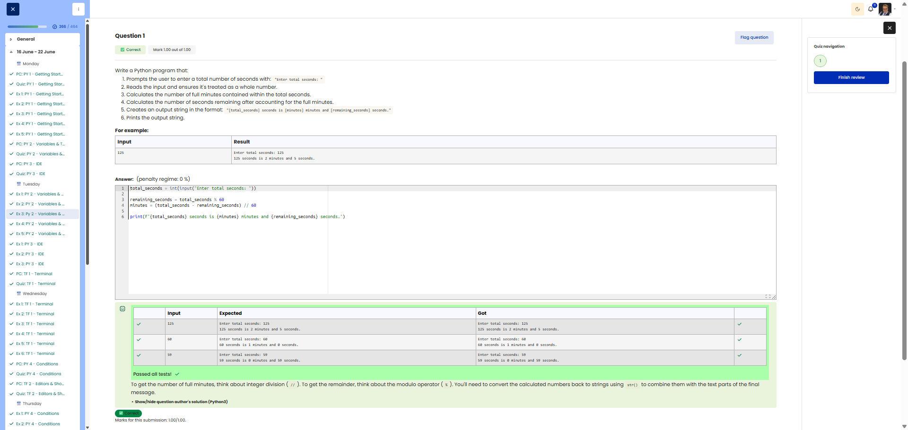

# 🐍 Name and Hobby Summary (String Concatenation)

**Course:** Cyber Security Analyst - Python Basics | **Date:** 17 June 2025

---

## Task

**Objective:** Prompt the user for their name and hobby, and output them as a formatted summary.

**Requirements:**
- Prompt 1: `First name:` (no space at the end)
- Prompt 2: `Favorite hobby:` (no space at the end)
- Output: `Summary: [Name]'s favorite hobby is [Hobby].`
- Use string concatenation with `+` or f-strings

---

## Solution

```python
Name = input("First name: ")
Hobby = input("Favorite hobby: ")
print("Summary: " + Name + "'s favorite hobby is " + Hobby + ".")
```

**Alternative solutions:**
```python
# Using f-strings (recommended)
name = input("First name: ")
hobby = input("Favourite hobby: ")
print(f"Summary: {name}'s favourite hobby is {hobby}.")

# Using .format()
name = input("First name: ")
hobby = input("Favourite hobby: ")
print("Summary: {}'s favourite hobby is {}.".format(name, hobby))

# With multiple print arguments (Note: Spaces!)
name = input("First name: ")
hobby = input("Favourite hobby: ")
print("Summary:", name + "'s favourite hobby is", hobby + ".")
```

---

## Tests

| Name | Hobby | Expected | Result | ✓ |
|------|-------|----------|----------|---|
| `Max` | `Gaming` | `Summary: Max's favourite hobby is Gaming.` | `Summary: Max's favourite hobby is Gaming.` | ✅ |
| `Anna` | `Reading` | `Summary: Anna's favourite hobby is Reading.` | `Summary: Anna's favourite hobby is Reading.` | ✅ |
| `Tom` | `Coding` | `Summary: Tom's favourite hobby is Coding.` | `Summary: Tom's favourite hobby is Coding.` | ✅ |

---

## Evidence

This evidence was added to the original solution structure. It documents the Cybersteps submission and keeps the original task, solution, tests, and notes intact.

The screenshot shows the course platform marking the submission as correct. The test table includes `125`, `60`, and `59`; for all cases, the expected output matches the actual output. The submission received `1.00/1.00`.



**Result:**

| Field | Entry |
|---|---|
| Execution environment | Browser-based course platform / Python exercise |
| Input | Total seconds |
| Operators | `//` for full minutes, `%` for remaining seconds |
| Verified inputs | `125`, `60`, `59` |
| Status | Passed |
| Score | 1.00/1.00 |

**Validation:**

- The exercise was marked correct by the course platform.
- The screenshot shows expected and actual output for three test cases.
- The screenshot is stored in `screenshots/`.
- The image link uses a relative path.
- No credentials, flags, or fabricated outputs are included.

**Security / Practice Relevance:**

This exercise practices converting raw numeric input into readable units. The same idea appears in scripts that summarize durations, counters, rates, or time windows.

## Notes

- **Concept:** String concatenation using the `+` operator
- **Important:** No automatic spaces with `+`!
- **Apostrophe:** `'s` is part of the string; no need to escape it in `""`
- **Best practice:** Use lower-case variable names (`name` instead of `Name`)
- **Comparison:**

| Method | Code | Readability |
|---------|------|---------- --|
| `+` operator | `"Hi " + name + "!"` | Average |
| f-string | `f"Hi {name}!"` | Very good |
| `.format()` | `"Hi {}!".format(name)` | Good |
