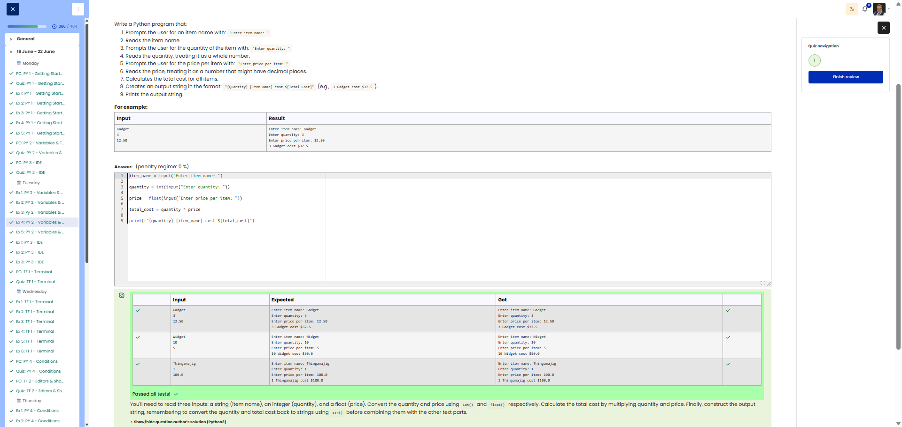

# 🐍 Item Cost Calculator (combining int and float)

**Course:** Cyber Security Analyst - Python Basics | **Date:** 17 June 2025

---

## Task

**Objective:** Read in the item name, quantity and price, and calculate the total cost.

**Requirements:**
- Prompt 1: `Enter item name: `
- Prompt 2: `Enter quantity: ` (as an integer)
- Prompt 3: `Enter price per item: ` (as a decimal)
- Calculation: `Total cost = Quantity × Price`
- Output: `[Quantity] [Item Name] cost $[Total Cost]`

---

## Solution

```python
item_name = input("Enter item name: ")
quantity = int(input("Enter quantity: "))
price = float(input("Enter price per item: "))
total_cost = quantity * price
print(f"{quantity} {item_name} cost ${total_cost}")
```

**Alternative solutions:**
```python
# With formatted decimal (2 decimal places)
item_name = input("Enter item name: ")
quantity = int(input("Enter quantity: "))
price = float(input("Enter price per item: "))
total_cost = quantity * price
print(f"{quantity} {item_name} cost ${total_cost:.2f}")

# Using string concatenation
item_name = input("Enter item name: ")
quantity = int(input("Enter quantity: "))
price = float(input("Enter price per item: "))
total_cost = quantity * price
print(str(quantity) + " " + item_name + " cost $" + str(total_cost))
```

---

## Tests

| Item     | Quantity | Price   | Expected              | Result              | ✓   |
| -------- | -------- | ------- | --------------------- | --------------------- | --- |
| `Gadget` | `3`      | `12.5`  | `3 Gadget cost $37.5` | `3 Gadget cost $37.5` | ✅   |
| `Apple`  | `5`      | `0.99`  | `5 Apple cost $4.95`  | `5 Apple cost $4.95`  | ✅   |
| `Book`   | `2`      | `19.99` | `2 Book cost $39.98`  | `2 Book cost $39.98`  | ✅   |

---

## Evidence

This evidence was added to the original solution structure. It documents the Cybersteps submission and keeps the original task, solution, tests, and notes intact.

The screenshot shows the course platform marking the submission as correct. The test table includes `Gadget` / `3` / `12.50`, `Widget` / `10` / `5`, and `Thingamajig` / `1` / `100.0`; for all cases, the expected output matches the actual output. The submission received `1.00/1.00`.



**Result:**

| Field | Entry |
|---|---|
| Execution environment | Browser-based course platform / Python exercise |
| Inputs | Item name, quantity, price per item |
| Type conversion | `int()` for quantity, `float()` for price |
| Calculation | `quantity * price` |
| Status | Passed |
| Score | 1.00/1.00 |

**Validation:**

- The exercise was marked correct by the course platform.
- The screenshot shows expected and actual output for three test cases.
- The screenshot is stored in `screenshots/`.
- The image link uses a relative path.
- No credentials, flags, or fabricated outputs are included.

**Security / Practice Relevance:**

This exercise practices handling mixed data types in one small workflow. Automation scripts often need this same care when combining labels, counts, and measured numeric values.

## Notes

- **Concept:** Combination of `int()` and `float()` type conversion
- **`int()`:** For integers (quantity)
- **`float()`:** For decimal numbers (price)
- **Formatting:** `:.2f` for 2 decimal places

**Number formatting in f-strings:**
| Format | Example | Result |
|--------|----------|----------|
| `{x}` | `{37.5}` | `37.5` |
| `{x:.2f}` | `{37.5:.2f}` | `37.50` |
| `{x:.0f}` | `{37.5:.0f}` | `38` |
| `{x:,.2f}` | `{1234.5:,.2f}` | `1,234.50` |

- **Tip:** For monetary amounts, use `:.2f` for consistent display
