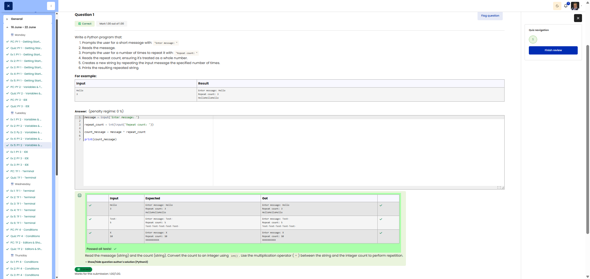

# 🐍 Message Repeater (String Multiplication)

**Course:** Cyber Security Analyst - Python Basics | **Date:** 17 June 2025

---

## Task

**Objective:** Read a message and repeat it multiple times.

**Requirements:**
- Prompt 1: `Enter message: `
- Prompt 2: `Repeat count: ` (as an integer)
- Calculation: String × count
- Output: Repeated string

---

## Solution

```python
message = input("Enter message: ")
repeat_count = int(input("Repeat count: "))
count_message = message * repeat_count
print(count_message)
```

**Alternative solutions:**
```python
# Compact
message = input("Enter message: ")
repeat_count = int(input("Repeat count: "))
print(message * repeat_count)

# With a line break between repetitions
message = input("Enter message: ")
repeat_count = int(input("Repeat count: "))
print((message + "\n") * repeat_count)

# With spaces between repetitions
message = input("Enter message: ")
repeat_count = int(input("Repeat count: "))
print((message + " ") * repeat_count)
```

---

## Tests

| Message | Count | Expected | Result | ✓ |
|---------|-------|----------|----------|---|
| `Hi` | `3` | `HiHiHi` | `HiHiHi` | ✅ |
| `Python ` | `2` | `Python Python ` | `Python Python ` | ✅ |
| `!` | `5` | `!!!!!` | `!!!!!` | ✅ |
| `Test` | `0` | `` (empty) | `` (empty) | ✅ |
| `X` | `1` | `X` | `X` | ✅ |

---

## Evidence

This evidence was added to the original solution structure. It documents the Cybersteps submission and keeps the original task, solution, tests, and notes intact.

The screenshot shows the course platform marking the submission as correct. The test table includes `Hello` / `3`, `Test-` / `5`, and `X` / `10`; for all cases, the expected output matches the actual output. The submission received `1.00/1.00`.



**Result:**

| Field | Entry |
|---|---|
| Execution environment | Browser-based course platform / Python exercise |
| Inputs | Message and repeat count |
| Type conversion | `int()` for repeat count |
| Core technique | String multiplication |
| Status | Passed |
| Score | 1.00/1.00 |

**Validation:**

- The exercise was marked correct by the course platform.
- The screenshot shows expected and actual output for three test cases.
- The screenshot is stored in `screenshots/`.
- The image link uses a relative path.
- No credentials, flags, or fabricated outputs are included.

**Security / Practice Relevance:**

This exercise practices controlled string repetition and numeric input conversion. The same idea can appear in simple test data generation, repeated labels, or controlled output formatting.

## Notes

- **Concept:** String multiplication using the `*` operator
- **Syntax:** `"text" * n` repeats the string n times
- **Important:** Only works with `int`, not with `float`!

**String operations:**
| Operation | Example | Result |
|---------- -|----------|----------|
| Concatenation | `"Hi" + "!"` | `"Hi!"` |
| Multiplication | `"Hi" * 3` | `"HiHiHi"` |
| Length | `len("Hi")` | `2` |

**Special cases:**
- `"text" * 0` → `""` (empty string)
- `"text" * 1` → `"text"` (no change)
- `"text" * -1` → `""` (negative numbers = empty string)

- **Tip:** Useful for separators: `print("-" * 50)`
