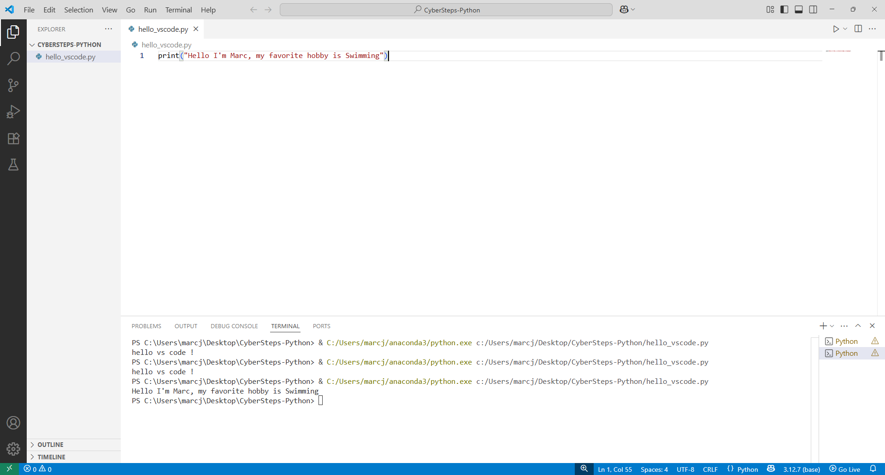

# 🐍 Code Runner (VS Code Setup)

**Course:** Cyber Security Analyst - Python Basics | **Date:** 18 June 2025

---

## Task

**Objective:** Create, save and run a simple Python script in VS Code.

**Requirements:**
- Launch VS Code and create a new file
- Write a script with your name and hobby
- Save it as `hello_vscode.py`
- Run it in the terminal

---

## Solution

### Steps 1–4: Create and save the script

```python
# hello_vscode.py
print("My name is John Doe")
print("My favourite hobby is programming")
```

**Alternative using f-strings:**
```python
# hello_vscode.py
name = "Max Mustermann"
hobby = "Programming"

print(f"My name is {name}")
print(f"My favourite hobby is {hobby}")
```

### Steps 5–7: Terminal and execution

```bash
# Open Terminal: View > Terminal or Ctrl+`

# Navigate to the folder
cd ~/cybersteps/python/03_ide

# Run the script
python3 hello_vscode.py
```

**Expected output:**
```
My name is Max Mustermann
My favourite hobby is programming
```

---

## Tests

| Action | Expected | Result | ✓ |
|--------|----------|----------|---|
| Create file | New empty file | New empty file | ✅ |
| Save as `.py` | Syntax highlighting active | Syntax highlighting active | ✅ |
| `python3 hello_vscode.py` | Output in terminal | Output in terminal | ✅ |

---

## Screenshot checklist

For submission, the screenshot must show:
- [x] VS Code window with `hello_vscode.py` open
- [x] Code visible in the editor
- [x] Integrated terminal visible
- [x] Command executed in the terminal
- [x] Output of the script in the terminal

---

## Evidence

This evidence was added to the original solution structure. It documents the Cybersteps submission and keeps the original task, solution, tests, and notes intact.

The screenshot shows hello_vscode.py in VS Code and successful execution in the integrated terminal.



## Notes

- **New file:** `Ctrl+N`
- **Save:** `Ctrl+S`
- **Open terminal:** `Ctrl+`` (backtick)
- **Important:** `.py` file extension for Python syntax highlighting
- **Tip:** `Tab` key for auto-completion in the terminal
- **Python3:** On some systems, use `python` instead of `python3`
