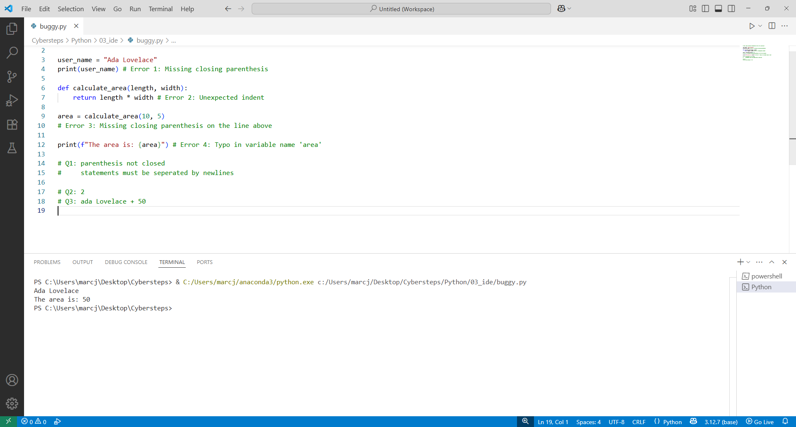

# 🐍 Bug Squasher (Bug Hunting & Debugging)

**Course:** Cyber Security Analyst - Python Basics | **Date:** 18 June 2025

---

## Task

**Objective:** Identify syntax errors using VS Code, analyse them in the Problems panel, and fix them.

**Requirements:**
- Create `buggy.py` with faulty code
- Identify and describe the errors
- Correct all errors
- Run the script successfully

---

## Faulty code (original)

```python
# This code contains deliberate errors for practice!

user_name = "Ada Lovelace"
print(user_name # Error 1: Missing closing parenthesis

def calculate_area(length, width):
return length * width # Error 2: Unexpected indent

area = calculate_area(10, 5
# Error 3: Missing closing parenthesis on the line above

print(f"The area is: {ares}") # Error 4: Typo in variable name 'area'
```

---

## Error analysis

| Error | Line | Problem | Description |
|--------|-------|---------|--------------|
| Error 1 | 4 | Missing `)` | `print(user_name` → `print(user_name)` |
| Error 2 | 7 | Missing indentation | `return` must be indented |
| Error 3 | 9 | Missing `)` | `calculate_area(10, 5` → `calculate_area(10, 5)` |
| Error 4 | 12 | Typo | `ares` → `area` |

---

## Corrected code (solution)

```python
# This code contains deliberate errors for practice!

user_name = "Ada Lovelace"
print(user_name)  # Error 1: FIXED - Added closing parenthesis

def calculate_area(length, width):
    return length * width  # Error 2: FIXED - Added proper indentation

area = calculate_area(10, 5)  # Error 3: FIXED - Added closing parenthesis

print(f"The area is: {area}")  # Error 4: FIXED - Corrected typo 'ares' to 'area'
```

---

## Answers to the questions

### Question 1: Visual cues in VS Code
**Answer:** VS Code highlights errors with the following visual cues:
- **Red underline:** Syntax errors are underlined in red
- **Yellow underline:** Warnings (e.g. unused variables)
- **Red X in the margin:** Error icon next to the line number
- **Red number in the status bar:** Number of errors at the bottom left

### Question 2: Number of issues in the Issues panel
**Answer:** The Problems panel initially shows **4 problems** (or more, as subsequent errors may occur). The exact number may vary, as one error often triggers further errors.

### Question 3: Successful execution
**Answer:** **Yes**, the script runs through without errors.

**Output:**
```
Ada Lovelace
The area is: 50
```

---

## Execution in the terminal

```bash
# Navigate to the folder
cd ~/cybersteps/python/03_ide

# Run the corrected script
python3 buggy.py
```

**Expected output:**
```
Ada Lovelace
The area is: 50
```

---

## Screenshot checklist

For submission, the screenshot must show:
- [ ] VS Code with corrected `buggy.py` code
- [ ] Problems panel empty or 0 errors
- [ ] Integrated terminal visible
- [ ] Successful output in the terminal

---

## Evidence

This evidence was added to the original solution structure. It documents the Cybersteps submission and keeps the original task, solution, tests, and notes intact.

The screenshot shows buggy.py in VS Code with corrected code, documented answers, and successful terminal output.



## Notes

- **Open the Problems panel:** `View > Problems` or `Ctrl+Shift+M`
- **Common syntax errors:**

| Error type | Example | Solution |
|---------- -|----------|--------|
| Missing parenthesis | `print("Hi"` | `print("Hi")` |
| Indentation error | `return x` (without indentation) | `    return x` |
| Undefined variable | `prnt("Hi")` | `print("Hi")` |
| Typo in variable | `naem` instead of `name` | Correct to `name` |

- **Tip:** Fix errors from top to bottom (one error can cause others)
- **Indentation in Python:** 4 spaces or 1 tab (stay consistent!)
- **Pylance Extension:** Improves error detection in VS Code
