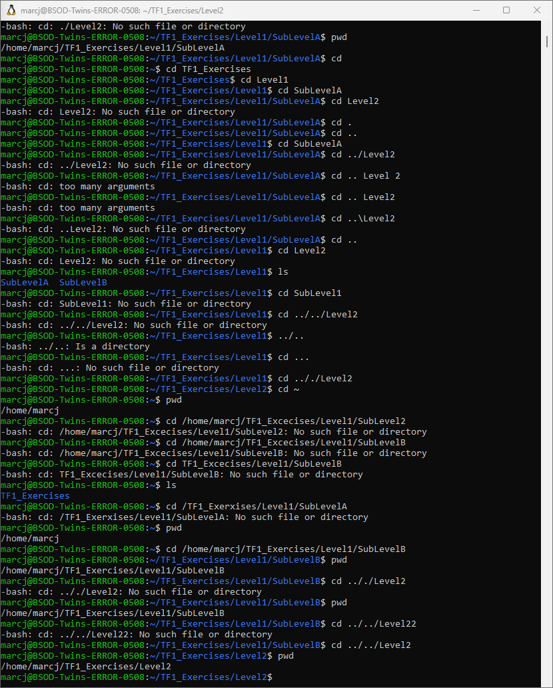
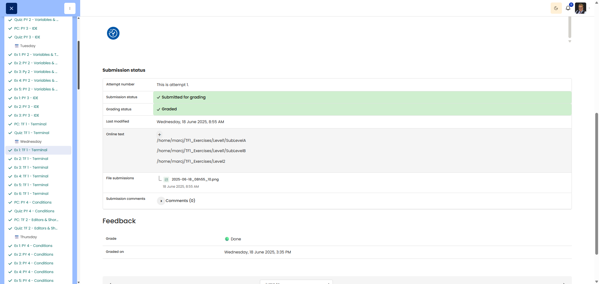

# 🖥️ Directory dance

**Course:** Cyber Security Analyst - Technical Fundament Basics | **Date:** 19 June 2025

---

## Task

**Objective:** Navigate through a directory structure using absolute and relative paths, checking the current location at each step.

---

## Solution

### Environment
```
OS: Win11
Shell: Powershell
```

### Procedure

**Step 1:** Open the terminal and check the home directory
```bash
pwd
```
**Output:** `/Users/username`

**Step 2:** Create the directory structure
```bash
mkdir -p ~/TF1_Exercises/Level1/SubLevelA
mkdir -p ~/TF1_Exercises/Level1/SubLevelB
mkdir -p ~/TF1_Exercises/Level2
```

**Step 3:** Check the structure
```bash
tree ~/TF1_Exercises
```
**Output:**
```
/Users/username/TF1_Exercises/
├── Level1/
│   ├── SubLevelA/
│   └── SubLevelB/
└── Level2/
```

**Step 4:** Navigate to SubLevelA using a relative path
```bash
cd TF1_Exercises/Level1/SubLevelA
```

**Step 5:** Check location (Question 5)
```bash
pwd
```
**Output:** `/Users/username/TF1_Exercises/Level1/SubLevelA`

**Step 6:** Navigate from SubLevelA to Level2 using a relative path
```bash
cd ../../Level2
```

**Step 7:** Check location (Question 7)
```bash
pwd
```
**Output:** `/Users/username/TF1_Exercises/Level2`

**Step 8:** Return to the home directory (shortest command)
```bash
cd ~
```
Alternative: `cd` (without arguments also takes you to the home directory)

**Step 9:** Check the home directory
```bash
pwd
```
**Output:** `/Users/username`

**Step 10:** Navigate to SubLevelB using an absolute path
```bash
cd /Users/username/TF1_Exercises/Level1/SubLevelB
```

**Step 11:** Check location (Question 11)
```bash
pwd
```
**Output:** `/Users/username/TF1_Exercises/Level1/SubLevelB`

---

## Results

| Question | Answer |
|-------|---------|
| Question 5 | `/Users/username/TF1_Exercises/Level1/SubLevelA` |
| Question 7 | `/Users/username/TF1_Exercises/Level2` |
| Question 11 | `/Users/username/TF1_Exercises/Level1/SubLevelB` |

---

## Evidence

This evidence was added to the original solution structure. It documents the Cybersteps submission and keeps the original task, solution, tests, and notes intact.

The screenshot shows navigation to /home/marcj/TF1_Exercises/Level1/SubLevelA, /home/marcj/TF1_Exercises/Level1/SubLevelB, and /home/marcj/TF1_Exercises/Level2.



The platform screenshot shows the assignment submitted and graded as Done.



**Screenshots:**


## Notes

- **Learnt:** Difference between absolute and relative paths
- **Relative paths:** Start from the current directory (e.g. `TF1_Exercises/Level1`)
- **Absolute paths:** Start from the root or home directory (e.g. `/Users/username/...`)
- **Tip:** `~` = home directory, `..` = parent directory, `.` = current directory
- **Important:** `cd ../../Level2` means: go up two levels, then into Level2
