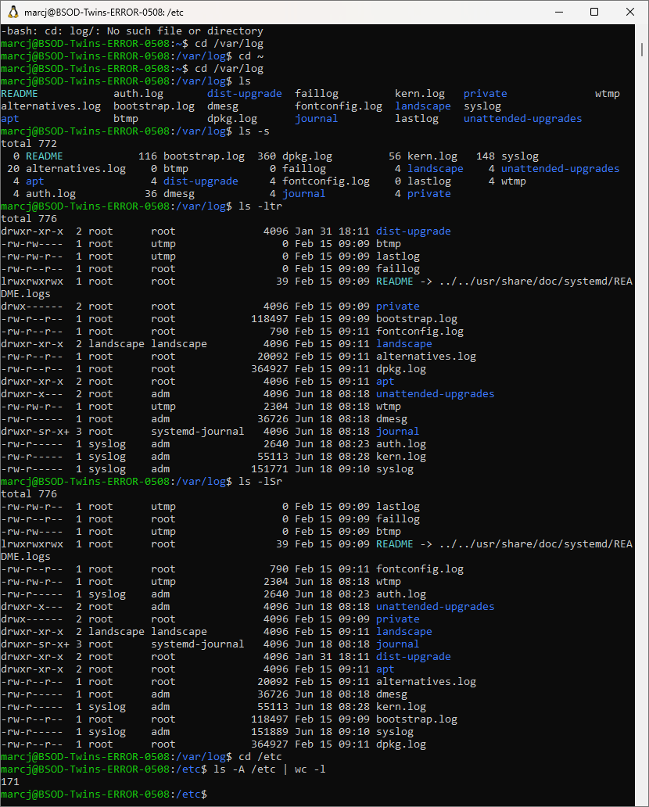
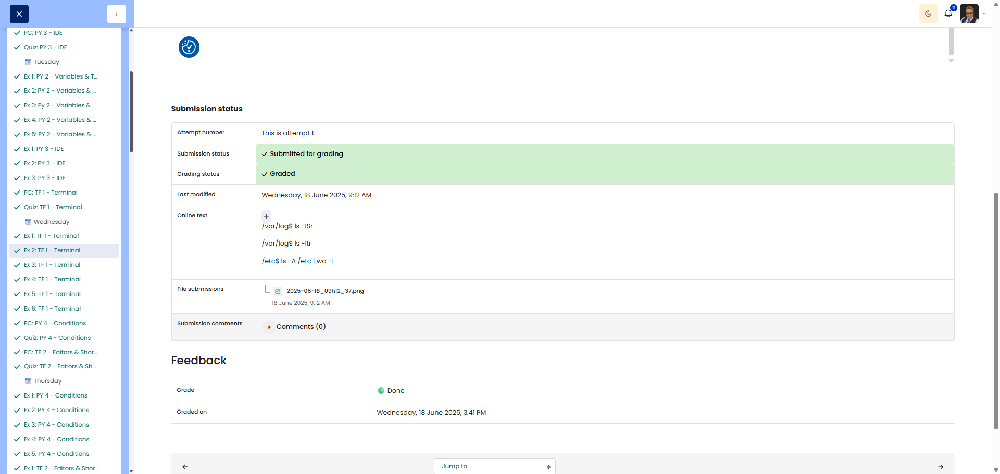

# 🖥️ Log Lurker

**Course:** Cyber Security Analyst - Technical Fundament Basics | **Date:** 19 June 2025

---

## Task

**Objective:** Use `ls` with various options and pipes to find information about files and count entries in system directories.

---

## Solution

### Environment
```
OS: Win11 (WSL/Ubuntu)
Shell: bash
```

### Procedure

**Step 1:** Navigate to the `/var/log` directory
```bash
cd /var/log
```

**Step 2:** Sort files by size (largest last)
```bash
ls -lS -r
```
**Explanation:**
- `-l` = Long format (displays size)
- `-S` = Sort by size (largest first)
- `-r` = Reverse (reverses the order so largest is last)

**Step 3:** Sort files by modification time (newest last)
```bash
ls -lt -r
```
**Explanation:**
- `-l` = Long format (shows size)
- `-t` = Sort by modification time (newest first)
- `-r` = Reverse (reverses the order so newest is last)

**Step 4:** Navigate to the `/etc` directory
```bash
cd /etc
```

**Step 5:** Count all entries (including hidden ones)
```bash
ls -a /etc | wc -l
```
**Explanation:**
- `-a` = All (also shows hidden files starting with `.`)
- `|` = Pipe (redirects output)
- `wc -l` = Word count, lines only (counts lines)

**Note:** The result also includes `.` and `..`; for the exact count excluding these:
```bash
ls -A /etc | wc -l
```
(`-A` shows hidden files, but excludes `.` and `..`)

---

## Results

| Step | Command |
|---------|--------|
| Step 2 (Size, largest last) | `ls -lSr` |
| Step 3 (Time, newest last) | `ls -ltr` |
| Step 5 (Count entries) | `ls -a /etc | wc -l` |

---

## Evidence

This evidence was added to the original solution structure. It documents the Cybersteps submission and keeps the original task, solution, tests, and notes intact.

The screenshot shows work in /var/log and /etc using ls -lSr, ls -ltr, and ls -A /etc | wc -l.



The platform screenshot shows the assignment submitted and graded as Done.



**Screenshots:**


## Notes

- **Learned:** `ls` options can be combined (`-lSr` instead of `-l -S -r`)
- **Tip:** `-r` reverses any sort order
- **Important:** `-a` shows ALL files, `-A` shows all except `.` and `..`
- **Pipe `|`:** Connects the output of one command to the input of the next
