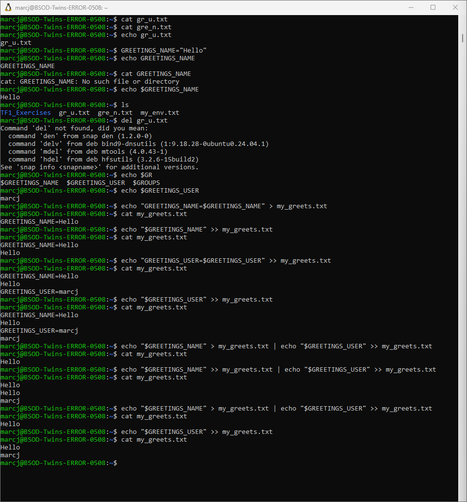
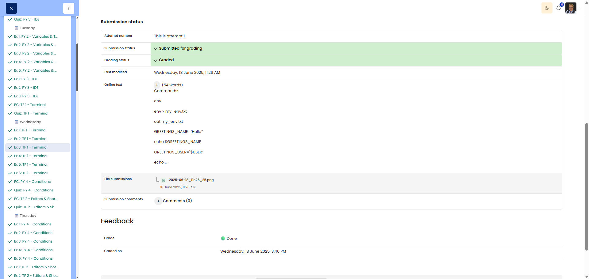

# 🖥️ Comfortable Environment

**Course:** Cyber Security Analyst - Technical Fundament Basics | **Date:** 19 June 2025

---

## Task

**Objective:** Exercise involving environment variables and output redirection (`>`, `>>`)

---

## Solution

### Environment
```
OS: Win11 (WSL/Ubuntu)
Shell: bash
```

### Procedure

**Step 1:** Command to display all environment variables
```bash
env
```
Alternative: `printenv`

**Step 2:** Redirect environment variables to a file
```bash
env > my_env.txt
```

**Step 3:** Output the PATH variable
```bash
echo $PATH
```
**Sample output:** `/usr/local/bin:/usr/bin:/bin:/usr/sbin:/sbin`

**Answer to Question 3:** The first folder in the list is `/usr/local/bin` (or, depending on the system, e.g. `/home/username/.local/bin`)

**Step 4:** Create and check the GREETINGS_NAME variable
```bash
GREETINGS_NAME="Hello"
echo $GREETINGS_NAME
```
**Output:** `Hello`

**Step 5:** Create the variable GREETINGS_USER with the value of USER
```bash
GREETINGS_USER=$USER
echo $GREETINGS_USER
```
**Output:** `username` (your username)

**Step 6:** Save both variables to a file (2 separate lines)
```bash
echo $GREETINGS_NAME > greetings.txt
echo $GREETINGS_USER >> greetings.txt
```
Alternative (one line):
```bash
echo -e "$GREETINGS_NAME\n$GREETINGS_USER" > greetings.txt
```

**Step 7:** Open a new terminal and repeat the command
```bash
echo $GREETINGS_NAME > greetings.txt
echo $GREETINGS_USER >> greetings.txt
```

**Answer to Question 7:** 
**No, it doesn’t work properly!** The variables `GREETINGS_NAME` and `GREETINGS_USER` no longer exist in the new terminal. The file is created, but with empty values.

**Explanation:** The variables created are only **shell variables** (local), not **exported environment variables**. They only exist in the current shell session. To make them available in new terminals, you would need to:
- use `export GREETINGS_NAME="Hello"`, OR
- Enter them in `~/.bashrc` or `~/.profile`

---

## Results

| Step | Command |
|---------|--------|
| Step 1 | `env` |
| Step 2 | `env > my_env.txt` |
| Step 3 | `echo $PATH` |
| Step 4 | `GREETINGS_NAME="Hello"` |
| Step 5 | `GREETINGS_USER=$USER` |
| Step 6 | `echo $GREETINGS_NAME > greetings.txt` and `echo $GREETINGS_USER >> greetings.txt` |

| Question | Answer |
|-------|------ ---|
| Question 3 | First directory in PATH: `/usr/local/bin` (system-dependent) |
| Question 7 | No – variables are only valid in the current shell session, not exported |

---

## Evidence

This evidence was added to the original solution structure. It documents the Cybersteps submission and keeps the original task, solution, tests, and notes intact.

The screenshot shows environment-variable work with GREETINGS_NAME, GREETINGS_USER, and my_greets.txt. Answer 3: first folder /usr/. Answer 7: the variable only exists in the current terminal session and has no value in a new session.



The platform screenshot shows the assignment submitted and graded as Done.



## Notes

- **Learned:** Difference between `>` (overwrite) and `>>` (append)
- **Important:** Shell variables vs. exported environment variables
- **Tip:** `export VAR=value` makes the variable available to child processes
- **Tip:** `$VAR` accesses the variable value
