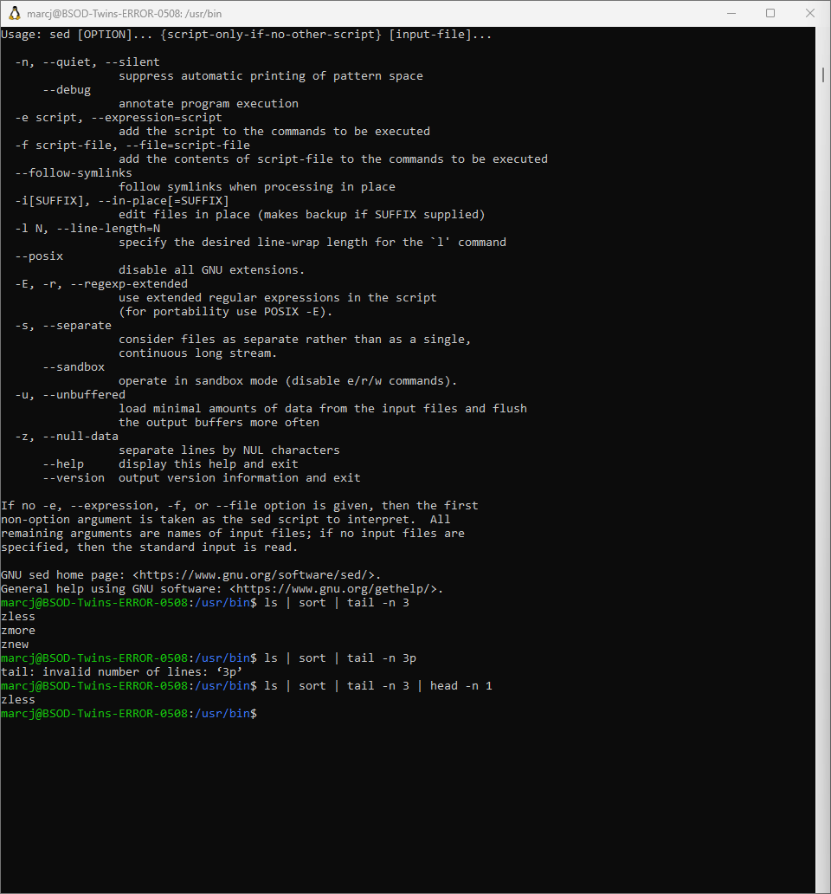
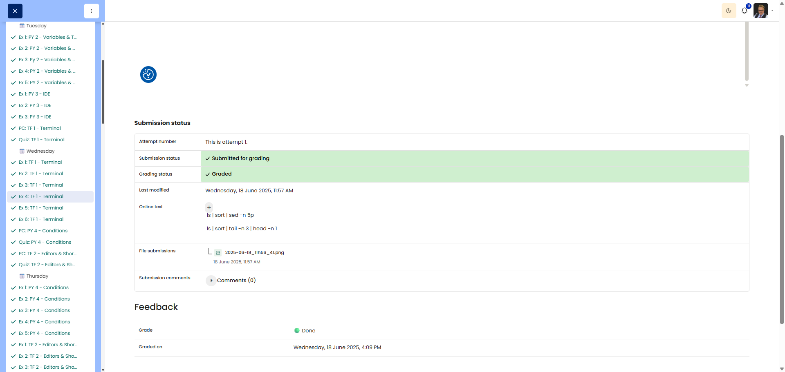

# 🖥️ Command Lineup

**Course:** Cyber Security Analyst - Technical Fundament Basics | **Date:** 19 June 2025

---

## Task

**Objective:** Create command pipelines using `ls`, `head`, `tail` and `sort` to isolate specific commands in `/usr/bin` based on their alphabetical position.

---

## Solution

### Environment
```
OS: Win11 (WSL/Ubuntu)
Shell: bash
```

### Procedure

**Step 1:** Explore the `/usr/bin` directory
```bash
ls /usr/bin | head -10
```
**Output:** Displays the first 10 commands sorted alphabetically

**Step 2:** Find the 5th command alphabetically
```bash
ls -1 /usr/bin | head -5 | tail -1
```
**Explanation:**
- `ls -1` = List with one entry per line
- `head -5` = Takes the first 5 lines
- `tail -1` = Takes the last line of those (= the 5th)

**Sample output:** `addpart` (system-dependent)

**Step 3:** Find the 3rd command from the end
```bash
ls -1 /usr/bin | tail -3 | head -1
```
**Explanation:**
- `ls -1` = List with one entry per line
- `tail -3` = Takes the last 3 lines
- `head -1` = Takes the first line from these (= 3rd from the end)

**Sample output:** `zmore` (system-dependent)

---

## Results

| Step | Command |
|---------|--------|
| Step 2 (5th alphabetically) | `ls -1 /usr/bin \| head -5 \| tail -1` |
| Step 3 (3rd from the end) | `ls -1 /usr/bin \| tail -3 \| head -1` |

---

## Evidence

This evidence was added to the original solution structure. It documents the Cybersteps submission and keeps the original task, solution, tests, and notes intact.

The screenshot shows pipeline commands using sort, tail, head, and sed. Used solutions: ls | sort | sed -n 5p and ls | sort | tail -n 3 | head -n 1.



The platform screenshot shows the assignment submitted and graded as Done.



## Notes

- **Learnt:** Combination of `head` and `tail` for precise line selection
- **Important:** `ls -1` (the number one) forces one line per entry
- **Tip:** `ls` sorts alphabetically by default
- **Logic for the nth entry:** `head -n | tail -1`
- **Logic for the nth from the end:** `tail -n | head -1`
- **Pipe `|`:** Concatenates commands – output becomes the input for the next
