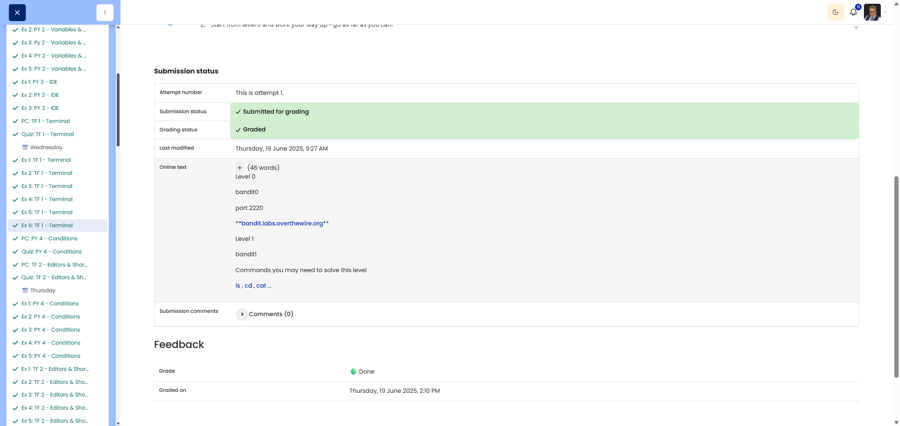

# 🖥️ Terminal Bandit

**Course:** Cyber Security Analyst - Technical Fundament Basics | **Date:** 19 June 2025

---

## Task

**Objective:** To improve command-line skills through the OverTheWire Bandit Challenge.

---

## Solution

### Environment
```
OS: Win11
Shell: PowerShell / WSL
```

### Establishing a connection

**SSH command:**
```bash
ssh bandit0@bandit.labs.overthewire.org -p 2220
```
Password for Level 0: `bandit0`

---

### Procedure

**Level 0 → 1**
```bash
# Note: The password is in a file in the home directory
cat readme
```
**Password for Level 1:** `ZjLjTmM6FvvyRnrb2rfNWOZOTa6ip5If`

---

**Level 1 → 2**
```bash
# Note: File name starts with "-" (special character)
cat ./-
```
**Password for Level 2:** `263JGJPfgU6LtdEvgfWU1XP5yac29mFx`

---

**Level 2 → 3**
```bash
# Hint: The exact filename contains spaces and leading/trailing dashes
cat -- "--spaces in this filename--"
# Alternative: cat ./--spaces\ in\ this\ filename--
```
**Password for Level 3:** `MNk8KNH3Usiio41PRUEoDFPqfxLPlSmx`

---

**Level 3 → 4**
```bash
# Hint: Hidden file in a subdirectory
cd inhere
ls -la
cat ...Hiding-From-You
```
**Password for Level 4:** `2WmrDFRmJIq3IPxneAaMGhap0pFhF3NJ`

---

**Level 4 → 5**
```bash
# Hint: Find the only human-readable file
cd inhere
file ./-file*
cat ./-file07
```
**Password for Level 5:** `4oQYVPkxZOOEOO5pTW81FB8j8lxXGUQw`

---

**Level 5 → 6**
```bash
# Hint: File with specific size (1033 bytes), not executable
find ./inhere -type f -size 1033c ! -executable
cat [found file]
```
**Password for Level 6:** `HWasnPhtq9AVKe0dmk45nxy20cvUa6EG`

---

**Level 6 → 7**
```bash
# Hint: File belongs to user bandit7, group bandit6, 33 bytes
find / -user bandit7 -group bandit6 -size 33c 2>/dev/null
cat [found file]
```
**Password for Level 7:** `morbNTDkSW6jIlUc0ymOdMaLnOlFVAaj`

---

**Level 7 → 8**
```bash
# Hint: Password next to the word "millionth" in data.txt
grep "millionth" data.txt
```
**Password for Level 8:** `dfwvzFQi4mU0wfNbFOe9RoWskMLg7eEc`

---

**Level 8 → 9**
```bash
# Hint: The only line that appears just once
sort data.txt | uniq -u
```
**Password for Level 9:** `4CKMh1JI91bUIZZPXDqGanal4xvAg0JM`

---

**Level 9 → 10**
```bash
# Hint: Human-readable string, starts with "="
strings data.txt | grep "^="
```
**Password for Level 10:** `FGUW5ilLVJrxX9kMYMmlN4MgbpfMiqey`

---

*Continue with further levels as required...*

---

## Results

| Level | Password |
|-------|----------|
| 0 → 1 | ZjLjTmM6FvvyRnrb2rfNWOZOTa6ip5If |
| 1 → 2 | 263JGJPfgU6LtdEvgfWU1XP5yac29mFx |
| 2 → 3 | MNk8KNH3Usiio41PRUEoDFPqfxLPlSmx |
| 3 → 4 | 2WmrDFRmJIq3IPxneAaMGhap0pFhF3NJ |
| 4 → 5 | 4oQYVPkxZOOEOO5pTW81FB8j8lxXGUQw |
| 5 → 6 | HWasnPhtq9AVKe0dmk45nxy20cvUa6EG |
| 6 → 7 | morbNTDkSW6jIlUc0ymOdMaLnOlFVAaj |
| 7 → 8 | dfwvzFQi4mU0wfNbFOe9RoWskMLg7eEc |
| 8 → 9 | 4CKMh1JI91bUIZZPXDqGanal4xvAg0JM |
| 9 → 10 | FGUW5ilLVJrxX9kMYMmlN4MgbpfMiqey |

**Highest level achieved:** 10

---

## Evidence

This evidence was added to the original solution structure. It documents the Cybersteps submission and keeps the original task, solution, tests, and notes intact.

The task was completed with OverTheWire Bandit. Documented access/results:

- Level 0: user `bandit0`, host `bandit.labs.overthewire.org`, port `2220`.
- Level 1: user `bandit1`, password `ZjLjTmM6FvvyRnrb2rfNWOZOTa6ip5If`.
- Level 2: user `bandit2`, password `263JGJPfgU6LtdEvgfWU1XP5yac29mFx`.
- Level 3: user `bandit3`, password `MNk8KNH3Usiio41PRUEoDFPqfxLPlSmx`.

Note: The filename containing a space was identified as the main pitfall for Level 3.

The platform screenshot shows the assignment submitted and graded as Done.



**Screenshots:**


## Notes

- **Learned:**
  - `cat ./-` for files starting with `-`
  - `cat "file name"` for files containing spaces
  - `ls -la` shows hidden files
  - `file` identifies file types
  - `find` with options such as `-size`, `-user`, `-group`
  - `grep` for text search
  - `sort | uniq -u` finds unique lines
  - `strings` extracts readable strings from binary files

- **Useful commands:**
  - `ssh user@host -p port` - SSH connection
  - `2>/dev/null` - Suppress error messages
  - `man [command]` - Display help

- **Tip:** The Bandit page provides guidance on the commands required for each level!
