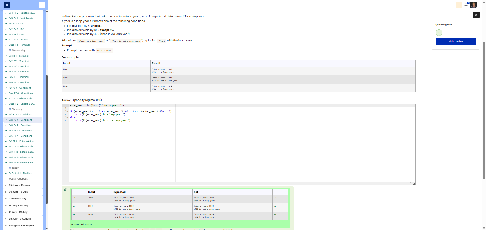

# 🐍 Leap Year Calculator

**Course:** Cyber Security Analyst - Python Basics | **Date:** 20 June 2025

---

## Task

**Objective:** Determine whether a year is a leap year.

**Requirements:**
- Prompt: `Enter a year:`
- Leap year rules:
  - Divisible by 4 → leap year, **EXCEPT**
  - Divisible by 100 → NOT a leap year, **EXCEPT**
  - Divisible by 400 → leap year
- Output: `<Year> is a leap year.` or `<Year> is not a leap year.`

---

## Solution

```python
year = int(input("Enter a year: "))

if (year % 400 == 0) or (year % 4 == 0 and year % 100 != 0):
    print(f"{year} is a leap year.")
else:
    print(f"{year} is not a leap year.")
```

**Alternative (more detailed):**
```python
year = int(input("Enter a year: "))

if year % 400 == 0:
    # Divisible by 400 → leap year
    print(f"{year} is a leap year.")
elif year % 100 == 0:
    # Divisible by 100 (but not 400) → NOT a leap year
    print(f"{year} is not a leap year.")
elif year % 4 == 0:
    # Divisible by 4 (but not 100) → Leap year
    print(f"{year} is a leap year.")
else:
    # Not divisible by 4 → NOT a leap year
    print(f"{year} is not a leap year.")
```

---

## Tests

| Input | Expected | Result | ✓ |
|-------|----------|----------|---|
| `2000` | `2000 is a leap year.` | `2000 is a leap year.` | ✅ |
| `1900` | `1900 is not a leap year.` | `1900 is not a leap year.` | ✅ |
| `2024` | `2024 is a leap year.` | `2024 is a leap year.` | ✅ |
| `2023` | `2023 is not a leap year.` | `2023 is not a leap year.` | ✅ |
| `2100` | `2100 is not a leap year.` | `2100 is not a leap year.` | ✅ |

---

## Leap year logic explained

```
Year entered
    │
    ├─ Divisible by 400? ──── YES ──→ LEAP YEAR ✓
    │         │
    │        NO
    │         │
    ├─ Divisible by 100? ──── YES ──→ NOT a leap year ✗
    │         │
    │        NO
    │         │
    └─ Divisible by 4? ────── YES ──→ LEAP YEAR ✓
              │
             NO
              │
              └───────────────── ─────→ NOT a leap year ✗
```

---

## Evidence

This evidence was added to the original solution structure. It documents the Cybersteps submission and keeps the original task, solution, tests, and notes intact.

The screenshot shows the leap year solution passing all tests.



## Notes

- **Concept:** Nested conditions, modulo operator
- **Modulo `%`:** Returns the remainder of a division
  - `2000 % 400 == 0` → True (no remainder)
  - `1900 % 400 == 300` → False (remainder 300)
- **Logical operators:**

| Operator | Meaning | Example |
|----------|-----------|----------|
| `and` | AND | `a > 0 and b > 0` |
| `or` | OR | `a > 0 or b > 0` |
| `not` | NOT | `not a > 0` |

- **Tip:** The order of evaluation is important (400 before 100 before 4)!
