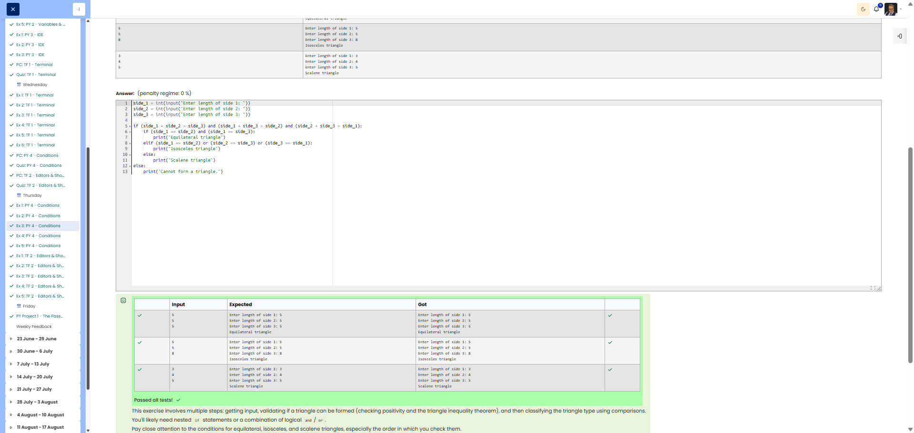

# 🐍 Triangle Classifier

**Course:** Cyber Security Analyst - Python Basics | **Date:** 20 June 2025

---

## Task

**Objective:** Read in three side lengths, check whether a triangle is possible, and classify it.

**Requirements:**
- Prompt 1: `Enter length of side 1:`
- Prompt 2: `Enter length of side 2:`
- Prompt 3: `Enter length of side 3:`
- Check triangle inequality: sum of two sides > third side
- Sides ≤ 0 → Not a triangle
- Output:
  - `Cannot form a triangle.`
  - `Equilateral triangle` (all equal)
  - `Isosceles triangle` (two equal)
  - `Scalene triangle` (all different)

---

## Solution

```python
s1 = int(input("Enter length of side 1: "))
s2 = int(input("Enter length of side 2: "))
s3 = int(input("Enter length of side 3: "))

# Check for positive values and triangle inequality
if s1 <= 0 or s2 <= 0 or s3 <= 0:
    print("Cannot form a triangle.")
elif s1 + s2 <= s3 or s1 + s3 <= s2 or s2 + s3 <= s1:
    print("Cannot form a triangle.")
elif s1 == s2 == s3:
    print("Equilateral triangle")
elif s1 == s2 or s1 == s3 or s2 == s3:
    print("Isosceles triangle")
else:
    print("Scalene triangle")
```

**Alternative (more compact):**
```python
s1 = int(input("Enter length of side 1: "))
s2 = int(input("Enter length of side 2: "))
s3 = int(input("Enter length of side 3: "))

# Combined check
if s1 <= 0 or s2 <= 0 or s3 <= 0 or s1 + s2 <= s3 or s1 + s3 <= s2 or s2 + s3 <= s1:
    print("Cannot form a triangle.")
elif s1 == s2 == s3:
    print("Equilateral triangle")
elif s1 == s2 or s1 == s3 or s2 == s3:
    print("Isosceles triangle")
else:
    print("Scalene triangle")
```

---

## Tests

| Side 1 | Side 2 | Side 3 | Expected | Result | ✓ |
|--------|--------|--------|----------|----------|---|
| `3` | `3` | `3` | `Equilateral triangle` | `Equilateral triangle` | ✅ |
| `5` | `5` | `3` | `Isosceles triangle` | `Isosceles triangle` | ✅ |
| `3` | `4` | `5` | `Scalene triangle` | `Scalene triangle` | ✅ |
| `1` | `2` | `10` | `Cannot form a triangle.` | `Cannot form a triangle. ` | ✅ |
| `0` | `5` | `5` | `Cannot form a triangle.` | `Cannot form a triangle.` | ✅ |
| `-1` | `3` | `3` | `Cannot form a triangle.` | `Cannot form a triangle.` | ✅ |
| `1` | `1` | `2` | `Cannot form a triangle.` | `Cannot form a triangle.` | ✅ |

---

## Types of triangles explained

| Type | English | Property |
|-----|---------|-------------|
| Equilateral | Equilateral | All 3 sides equal |
| Isosceles | Isosceles | Exactly 2 sides equal |
| Scalene | Scalene | All 3 sides different |

**Triangle inequality:**
```
a + b > c
a + c > b
b + c > a
```
All three conditions must be satisfied!

---

## Evidence

This evidence was added to the original solution structure. It documents the Cybersteps submission and keeps the original task, solution, tests, and notes intact.

The screenshot shows the triangle classifier solution passing all tests.



## Notes

- **Concept:** Multiple conditions, chained comparisons
- **Chaining:** `s1 == s2 == s3` is valid in Python!
- **Order is important:**
  1. First check if a triangle is possible
  2. Then classify
- **Edge Cases:**
  - Side ≤ 0 → No triangle
  - `a + b = c` (sum equals) → No triangle (must be **greater than**)

- **Tip:** With `or`, the first true condition is taken (short-circuit)
