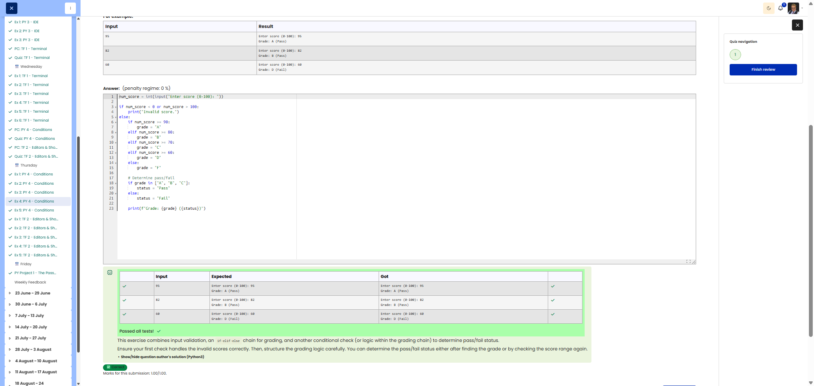

# 🐍 Grade Calculator

**Course:** Cyber Security Analyst - Python Basics | **Date:** 20 June 2025

---

## Task

**Objective:** Convert a raw score into a grade and determine whether the result is a pass or a fail.

**Requirements:**
- Prompt: `Enter score (0-100):`
- Validation: < 0 or > 100 → `Invalid score.`
- Grading scale:
  - 90-100: A
  - 80-89: B
  - 70-79: C
  - 60-69: D
  - 0-59: F
- D and F = Fail, otherwise Pass
- Output: `Grade: <Letter> (<Pass/Fail>)`

---

## Solution

```python
score = int(input("Enter score (0-100): "))

if score < 0 or score > 100:
    print("Invalid score.")
elif score >= 90:
    print("Grade: A (Pass)")
elif score >= 80:
    print("Grade: B (Pass)")
elif score >= 70:
    print("Grade: C (Pass)")
elif score >= 60:
    print("Grade: D (Fail)")
else:
    print("Grade: F (Fail)")
```

**Alternative (using variables):**
```python
score = int(input("Enter score (0-100): "))

if score < 0 or score > 100:
    print("Invalid score.")
else:
    # Determine grade
    if score >= 90:
        grade = "A"
    elif score >= 80:
        grade = "B"
    elif score >= 70:
        grade = "C"
    elif score >= 60:
        grade = "D"
    else:
        grade = "F"
    
    # Determine Pass/Fail
    if grade in ["D", "F"]:
        status = "Fail"
    else:
        status = "Pass"
    
    print(f"Grade: {grade} ({status})")
```

---

## Tests

| Input | Expected | Result | ✓ |
|-------|----------|----------|---|
| `95` | `Grade: A (Pass)` | `Grade: A (Pass)` | ✅ |
| `82` | `Grade: B (Pass)` | `Grade: B (Pass)` | ✅ |
| `75` | `Grade: C (Pass)` | `Grade: C (Pass)` | ✅ |
| `60` | `Grade: D (Fail)` | `Grade: D (Fail)` | ✅ |
| `45` | `Grade: F (Fail)` | `Grade: F (Fail)` | ✅ |
| `100` | `Grade: A (Pass)` | `Grade: A (Pass)` | ✅ |
| `0` | `Grade: F (Fail)` | `Grade: F (Fail)` | ✅ |
| `-5` | `Invalid score.` | `Invalid score.` | ✅ |
| `105` | `Invalid score.` | `Invalid score.` | ✅ |

---

## Grading Scale Overview

| Points | Grade | Status |
|--------|------|--------|
| 90-100 | A | Pass ✅ |
| 80-89 | B | Pass ✅ |
| 70-79 | C | Pass ✅ |
| 60-69 | D | Fail ❌ |
| 0-59 | F | Fail ❌ |

---

## Evidence

This evidence was added to the original solution structure. It documents the Cybersteps submission and keeps the original task, solution, tests, and notes intact.

The screenshot shows the grade calculator solution passing all tests.



**Screenshots:**


## Notes

- **Concept:** Input validation, multi-level conditions
- **Order:** Check from top to bottom (90 → 80 → 70 → 60 → else)
- **Why `>=` works:** 
  - When `score = 85`, `score >= 90` is False
  - Then `score >= 80` is True → "B"
  - The remaining conditions are not checked

- **`in` operator:** Checks whether an element is contained in a list
  ```python
  grade in ["D", "F"]  # True if grade is D or F
  ```

- **Testing thresholds:** Always test 0, 59, 60, 69, 70, 79, 80, 89, 90, 100!
