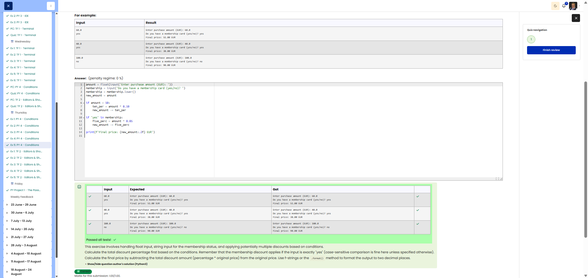

# 🐍 Discount System

**Course:** Cyber Security Analyst - Python Basics | **Date:** 20 June 2025

---

## Task

**Objective:** Implement a discount system with stacked discounts.

**Requirements:**
- Prompt 1: `Enter purchase amount (EUR):`
- Prompt 2: `Do you have a membership card (yes/no)?`
- Discount rules:
  - Amount > 50.0 EUR → 10% discount
  - Membership card (`yes`) → additional 5% discount
  - Both discounts are calculated on the **original amount**
- Output: `Final price: XX.XX EUR` (2 decimal places)

---

## Solution

```python
amount = float(input("Enter purchase amount (EUR): "))
membership = input("Do you have a membership card (yes/no)? ")

discount = 0

# 10% discount if amount > 50
if amount > 50.0:
    discount += amount * 0.10

# 5% discount for members (always on the original amount)
if membership == "yes":
    discount += amount * 0.05

final_price = amount - discount
print(f"Final price: {final_price:.2f} EUR")
```

**Alternative (using a percentage variable):**
```python
amount = float(input("Enter purchase amount (EUR): "))
membership = input("Do you have a membership card (yes/no)? ")

discount_percent = 0

if amount > 50.0:
    discount_percent += 10

if membership == "yes":
    discount_percent += 5

final_price = amount * (1 - discount_percent / 100)
print(f"Final price: {final_price:.2f} EUR")
```

---

## Tests

| Amount | Membership | Discount | Expected | Result | ✓ |
|--------|------------|--------|----------|----------|---|
| `60.0` | `yes` | 10% + 5% = 15% | `Final price: 51.00 EUR` | `Final price: 51.00 EUR` | ✅ |
| `40.0` | `yes` | 0% + 5% = 5% | `Final price: 38.00 EUR` | `Final price: 38.00 EUR` | ✅ |
| `100.0` | `no` | 10% + 0% = 10% | `Final price: 90.00 EUR` | `Final price: 90.00 EUR` | ✅ |
| `50.0` | `yes` | 0% + 5% = 5% | `Final price: 47.50 EUR` | `Final price: 47.50 EUR` | ✅ |
| `50.0` | `no` | 0% | `Final price: 50.00 EUR` | `Final price: 50.00 EUR` | ✅ |
| `30.0` | `no` | 0% | `Final price: 30.00 EUR` | `Final price: 30.00 EUR` | ✅ |

---

## How discounts are calculated

**Example: 60.0 EUR with a membership card**
```
Original amount:     60.00 EUR
10% discount (>50):   60.00 × 0.10 = 6.00 EUR
5% member discount:   60.00 × 0.05 = 3.00 EUR
──────────────────────────── ─────────────
Total discount:       6.00 + 3.00 = 9.00 EUR
Final price:           60.00 - 9.00 = 51.00 EUR
```

**Important:** Both discounts are calculated on the **original amount**, not one after the other!

---

## Discount matrix

| Amount | Member | Discount |
|--------|----------|--------|
| ≤ 50 | no | 0% |
| ≤ 50 | yes | 5% |
| > 50 | no | 10% |
| > 50 | yes | 15% |

---

## Evidence

This evidence was added to the original solution structure. It documents the Cybersteps submission and keeps the original task, solution, tests, and notes intact.

The screenshot shows the discount system solution passing all tests.



**Screenshots:**


## Notes

- **Concept:** Multiple independent `if` conditions (no `elif`!)
- **Important:** `>` (strictly greater than) not `>=`! 50.0 EUR does NOT receive a 10% discount
- **`+=` operator:** `discount += x` is the same as `discount = discount + x`
- **Formatting:** `:.2f` for exactly 2 decimal places

**Difference between `if` and `elif`:**
```python
# With elif – only ONE condition is executed
if amount > 50:
    # ...
elif membership == "yes":
    # Is NOT checked if amount > 50!

# With separate if statements – BOTH are checked
if amount > 50:
    # ...
if membership == "yes":
    # Is ALSO checked!
```

- **Tip:** Use separate `if` statements when conditions are independent and can be stacked!
