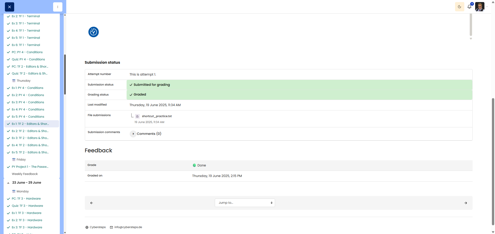

# 🖥️ Shortcut Showdown (Keyboard Shortcut Training)

**Course:** Cyber Security Analyst - Technical Fundament Basics | **Date:** 20 June 2025

---

## Task

**Objective:** Practise basic Windows 11 and Sublime Text shortcuts for navigation, selection and editing without using a mouse.

---

## Solution

### Environment
```text
OS: Windows 11
Editor: Sublime Text
```

### Source text

```text
The quick brown fox
jumps over the lazy dog.
Pack my box with
five dozen liquor jugs.
```

### Procedure

**Step 1:** Create a new file
```text
Ctrl+N
```

**Step 2:** Copy and paste text
```text
Ctrl+A  (Select All)
Ctrl+C  (Copy)
Ctrl+V  (Paste)
```

**Step 3:** Move the cursor to the word `quick`
```text
Home             -> Start of line
Ctrl+Right Arrow -> Jump to next word
```

**Step 4:** Select the word `quick`
```text
Ctrl+Shift+Right Arrow  OR  Ctrl+D
```

**Step 5:** Cut the word `quick`
```text
Ctrl+X
```

**Step 6:** Move to the end of the line and paste `quick`
```text
End
Spacebar
Ctrl+V
```
**Result:** `The brown fox quick`

**Step 7:** Go to the second line, start of line
```text
Down Arrow
Home
```

**Step 8:** Select the entire second line
```text
Ctrl+L
```

**Step 9:** Duplicate the line
```text
Ctrl+Shift+D
```

**Step 10:** Go to the start of the file
```text
Ctrl+Home
```

**Step 11:** Select the first two lines
```text
Ctrl+L  (2x)  OR  Shift+Down Arrow (2x)
```

**Step 12:** Copy the selection
```text
Ctrl+C
```

**Step 13:** Go to the end of the file and start a new line
```text
Ctrl+End
Enter
```

**Step 14:** Paste
```text
Ctrl+V
```

**Step 15:** Undo
```text
Ctrl+Z
```

**Step 16:** Redo
```text
Ctrl+Y
```

**Step 17:** Save as `shortcut_practice.txt`
```text
Ctrl+S -> Enter filename -> Enter
```

---

## Final result

```text
The brown fox quick
jumps over the lazy dog.
jumps over the lazy dog.
Pack my box with
five dozen liquor jugs.
The brown fox quick
jumps over the lazy dog.
```

---

## Shortcut overview

| Shortcut | Action |
|----------|--------|
| `Ctrl+N` | New file |
| `Ctrl+S` | Save |
| `Ctrl+A` | Select All |
| `Ctrl+C` | Copy |
| `Ctrl+V` | Paste |
| `Ctrl+X` | Cut |
| `Ctrl+Z` | Undo |
| `Ctrl+Y` | Redo |
| `Ctrl+D` | Select next matching word |
| `Ctrl+L` | Select line |
| `Ctrl+Shift+D` | Duplicate line |
| `Home` / `End` | Start/end of line |
| `Ctrl+Home` / `Ctrl+End` | Start/end of file |
| `Ctrl+Left/Right` | Jump by word |
| `Ctrl+Shift+Arrow` | Select by word |

---

## Evidence

This evidence was added to the original solution structure. It documents the Cybersteps submission and keeps the original task, solution, tests, and notes intact.

The final shortcut_practice.txt file documents the text exercise completed using keyboard shortcuts.

[Evidence file](shortcut_practice.txt)

The platform screenshot shows the assignment submitted and graded as Done.



## Notes

- **Learned:** Navigation and selection without a mouse.
- **Tip:** On Windows, `Ctrl` is the main modifier for editor shortcuts.
- **Important:** The final text above is the stable, correct target result for this exercise.
