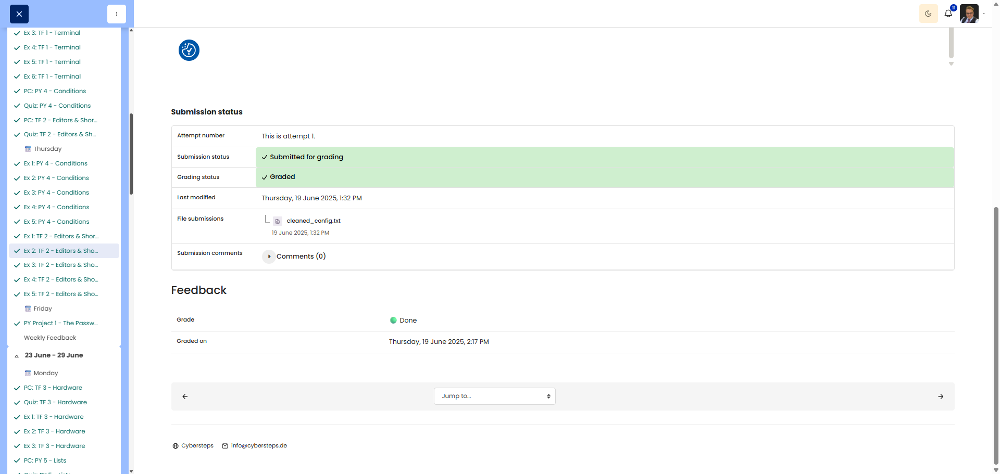

# 🖥️ Config Cleanup Crew (Cleaning up the configuration)

**Course:** Cyber Security Analyst - Technical Fundament Basics | **Date:** 20 June 2025

---

## Task

**Objective:** Clean up a configuration file efficiently in Sublime Text by using Windows shortcuts, Find/Replace, and regex.

---

## Solution

### Environment
```text
OS: Windows 11
Editor: Sublime Text
```

### Source text

```text
# Server Settings - Needs Review

server_name: webserver_alpha # Old naming convention
port_number: 8080 # Standard HTTP port
isEnabled: true # Should be boolean
admin_email: 'admin@example.com' # Contact point
log_level: 'DEBUG' # TODO: Change to INFO for production

server_name: appserver_beta # Old naming convention
port_number: 9001 # Custom app port
isEnabled: true # Should be boolean
admin_email: 'admin@example.com' # Contact point
log_level: 'DEBUG' # TODO: Change to INFO for production

server_name: dbserver_gamma # Old naming convention
port_number: 5432 # Standard DB port
isEnabled: false # Should be boolean
admin_email: 'support@example.com' # Different contact
log_level: 'WARN' # TODO: Change to INFO for production
```

### Procedure

**Task 1:** Add `_v2` to the three server names

```text
1. Ctrl+H                -> Open Find & Replace
2. Find:    webserver_alpha
3. Replace: webserver_alpha_v2
4. Replace All

Repeat for webserver_beta and dbserver_gamma.
```

**Task 2:** `isEnabled: true` -> `enabled: true`

```text
1. Ctrl+H
2. Find:    isEnabled: true
3. Replace: enabled: true
4. Replace All
```

**Task 3:** `isEnabled: false` -> `enabled: false`

```text
1. Ctrl+H
2. Find:    isEnabled: false
3. Replace: enabled: false
4. Replace All
```

**Task 4:** Remove all TODO lines with regex

```text
1. Ctrl+H
2. Alt+R                 -> Enable Regex
3. Find:    ^.*# TODO: Change to INFO for production\r?\n?
4. Replace: (leave blank)
5. Replace All
```

**Task 5:** Save the cleaned file

```text
Ctrl+S
```

---

## Final result

```text
# Server Settings - Needs Review

server_name: webserver_alpha_v2 # Old naming convention
port_number: 8080 # Standard HTTP port
enabled: true # Should be boolean
admin_email: 'admin@example.com' # Contact point

server_name: appserver_beta_v2 # Old naming convention
port_number: 9001 # Custom app port
enabled: true # Should be boolean
admin_email: 'admin@example.com' # Contact point

server_name: dbserver_gamma_v2 # Old naming convention
port_number: 5432 # Standard DB port
enabled: false # Should be boolean
admin_email: 'support@example.com' # Different contact
```

---

## Summary of actions

| Task | Method | Shortcuts |
|---------|---------|-----------|
| Add `_v2` | Find & Replace | `Ctrl+H` |
| `isEnabled: true` | Find & Replace | `Ctrl+H` |
| `isEnabled: false` | Find & Replace | `Ctrl+H` |
| Delete TODO lines | Regex Find & Replace | `Ctrl+H`, `Alt+R` |
| Save | Save | `Ctrl+S` |

---

## Evidence

This evidence was added to the original solution structure. It documents the Cybersteps submission and keeps the original task, solution, tests, and notes intact.

The final cleaned_config.txt file contains the cleaned configuration. Find/replace, keyboard navigation, and removal of TODO lines were used.

[Evidence file](cleaned_config.txt)

The platform screenshot shows the assignment submitted and graded as Done.



## Notes

- **Learned:** Find & Replace, regex cleanup, repeatable editing.
- **Important:** The corrected target text above is the truthful expected result for this exact input.
- **Tip:** Regex is the cleanest solution when the same pattern appears on multiple lines.
