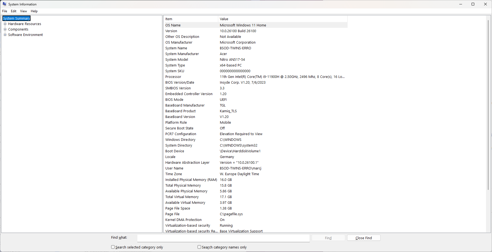
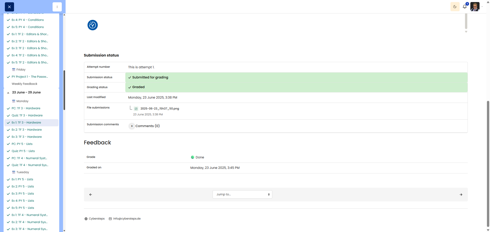

# 🖥️ Know Thyself - System Information

**Course:** Cyber Security Analyst - Technical Fundament Basics | **Date:** 23 June 2025

---

## Task

**Objective:** To accurately document the hardware specifications of your own Windows 11 system.

**Task:**
- Open `System Information` and record hardware details
- Note down specific information regarding the CPU, RAM, graphics and storage
- Take a screenshot of the system overview

---

## Solution

### Environment
```text
OS: Windows 11
Device: own laptop or desktop
```

### Procedure

**Step 1:** Open System Information
```powershell
msinfo32
```

**Alternative methods:**
- `Win+S` -> Search for `System Information`
- `Settings` -> `System` -> `About`

**Step 2:** Retrieve hardware information
- In `System Information`, open the **System Overview**
- For GPU details, go to `Components -> Display`
- For storage media, go to `Components -> Storage -> Drives`

**Step 3:** Record data

---

## Results

```text
This task is device-dependent.
A technically correct submission contains the actual values of your own Windows 11 system,
not made-up example values.
```

| Hardware component | To be entered |
|---------------------|-------------|
| **Processor / CPU** | your own CPU name |
| **Installed RAM** | e.g. 16 GB |
| **Graphics** | GPU name from `Display` |
| **System drive** | e.g. C: / model name |
| **System model** | Device model as per `System Overview` |

**Screenshot:** System Overview or Info page with the relevant data.

---

## Evidence

This evidence was added to the original solution structure. It documents the Cybersteps submission and keeps the original task, solution, tests, and notes intact.

The screenshot shows Windows System Information with operating system, model, CPU, RAM, and other hardware details.



The platform screenshot shows the assignment submitted and graded as Done.




## Notes

- **Learned:** Where Windows 11 displays key hardware data.
- **Important:** The values must be taken live from your own device.
- **Tip:** `msinfo32` is the most direct built-in Windows solution for this task.
