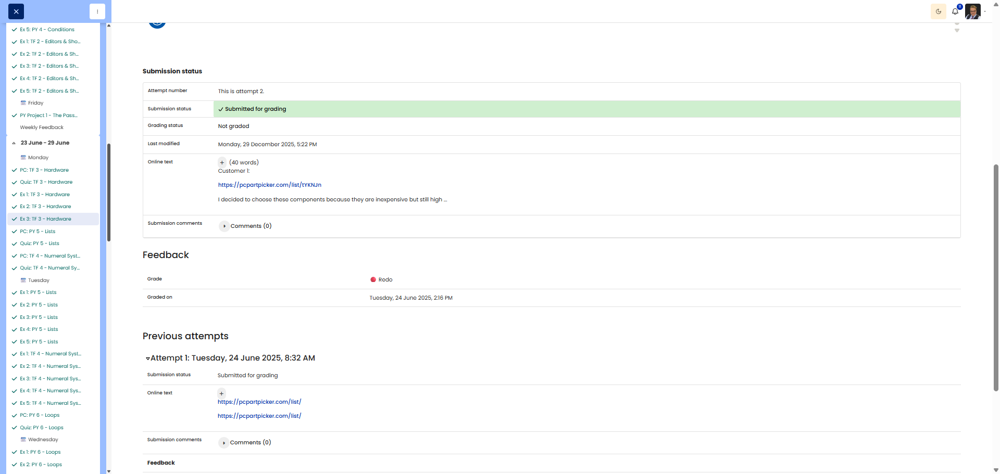

# 🖥️ Bob the Builder - PC Configuration

**Course:** Cyber Security Analyst - Technical Fundament Basics | **Date:** 23 June 2025

---

## Task

**Objective:** Create two bespoke PC builds for different customer requirements using PCPartPicker

**Task:* *
- Customer 1: Home office user (Budget: $650–750)
- Customer 2: Aspiring streamer/gamer (Budget: $1,300–1,450)
- Components: CPU, motherboard, RAM, storage, GPU, case, PSU
- Create builds on pcpartpicker.com and justify your choices

---

## Solution

### Environment
```
Website: https://pcpartpicker.com/
Tool: System Builder
```

### Procedure

**Step 1:** Open PCPartPicker
```
1. Navigate to https://pcpartpicker.com/
2. Click "System Builder"
3. Select components
```

**Step 2:** Create build
- Select components for each category
- Pay attention to compatibility warnings
- Keep an eye on the total price
- Copy the permalink (URL such as https://pcpartpicker.com/list/xxxxxx)

---

## Results

### **Customer 1: Home Office User**

**Budget:** $650 - $750 USD  
**Requirements:** Multitasking, browser tabs, spreadsheets, video calls, no gaming/video editing

**Build link:** [https://pcpartpicker.com/list/tYKNJn](https://pcpartpicker.com/list/tYKNJn)

**Reasoning behind component selection:**

| Component | Choice | Reason |
|------------|------|------------|
| **CPU** | [e.g. Intel Core i3 / AMD Ryzen 5] | Sufficient cores for multitasking, good value for money for office tasks |
| **RAM** | [e.g. 16GB DDR4] | 16GB allows for multiple browser tabs + spreadsheets + video calls simultaneously without slowdowns |
| **Storage** | [e.g. 500GB NVMe SSD] | SSD ensures a ‘snappy’ feel when switching between apps, fast boot times |
| **GPU** | [e.g. Integrated Graphics] | Integrated graphics are sufficient for office use, saving on budget |

**Overall rationale:** Budget-efficient components with a focus on RAM (multitasking) and SSD (responsiveness). Integrated graphics save money for more RAM and better storage.

---

### **Customer 2: Aspiring Streamer/Gamer**

**Budget:** $1300 - $1450 USD  
**Requirements:** Gaming @1440p, streaming, video editing, modern titles (FPS, open-world RPGs)

**Build link:** [https://pcpartpicker.com/list/y8gCBq](https://pcpartpicker.com/list/y8gCBq)

**Reasons for component selection:**

| Component | Choice | Reason |
|------------|------|----------- -|
| **CPU** | [e.g. AMD Ryzen 7 / Intel Core i7] | Multi-core performance for simultaneous gaming + streaming + video encoding |
| **GPU** | [e.g. NVIDIA RTX 4060 Ti / AMD RX 7700 XT] | Dedicated GPU for 1440p gaming, hardware encoding for streaming |
| **RAM** | [e.g. 32GB DDR4/DDR5] | 32GB for gaming + OBS streaming + Chrome (chat) + video editing software |
| **Storage** | [e.g. 1TB NVMe SSD] | Fast storage for large games + video projects, fast render times |

**Overall rationale:** Balance between a powerful GPU (1440p gaming) and a multi-core CPU (streaming/editing). 32GB RAM prevents bottlenecks during multitasking. Investment in high-performance components maximises streaming quality.

---

## Evidence

This evidence was added to the original solution structure. It documents the Cybersteps submission and keeps the original task, solution, tests, and notes intact.

Customer 1: https://pcpartpicker.com/list/tYKNJn

I decided to choose these components because they are inexpensive but still high quality and meet the customer's requirements.

Customer 2: https://pcpartpicker.com/list/y8gCBq

I chose this configuration because it delivers the highest performance for the money.

The platform screenshot documents the resubmitted second attempt for this assignment. The second attempt was confirmed as passed.



## Notes

- **Learned:** Component selection based on use case, budget optimisation, avoiding bottlenecks
- **Home Office Build:** Focus on responsiveness (SSD) and multitasking (RAM), graphics unimportant
- **Gaming/Streaming Build:** CPU/GPU balance critical, more RAM = better multitasking
- **PCPartPicker:** Automatic compatibility check very helpful
- **Trade-offs:** 
  - Office: Integrated GPU → more budget for RAM/SSD
  - Gaming: Dedicated GPU essential, CPU must handle streaming + gaming
- **Tip:** For streaming builds, prefer NVIDIA GPUs (NVENC hardware encoding)
