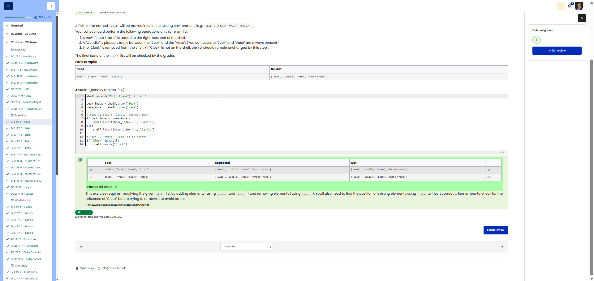

**Course:** Cyber Security Analyst - Python Basics | **Date:** 24 June 2025

---

## Task

**Objective:** Manipulate a predefined list `shelf` by adding, inserting and removing elements

**Requirements:**
- List: `shelf` (predefined, e.g. `["Book", "Vase", "Clock"]`)
- Operation 1: Add "Photo Frame" to the end
- Operation 2: Insert "Candle" between "Book" and "Vase"
- Operation 3: Remove "Clock" (if present)
- Edge Cases: If "Clock" does not exist → leave the list unchanged

---

## Solution

```python
# 1. Add "Photo Frame" to the end
shelf.append("Photo Frame")

# 2. Insert "Candle" between "Book" and "Vase"
book_index = shelf.index("Book")
shelf.insert(book_index + 1, "Candle")

# 3. Remove "Clock" if present
if "Clock" in shelf:
    shelf.remove("Clock")
```

---

## Tests

| Input | Expected | Result | ✓ |
|-------|------ ----|----------|---|
| `shelf = ["Book", "Vase", "Clock"]` | `['Book', 'Candle', 'Vase', 'Photo Frame']` | `['Book', 'Candle', 'Vase', 'Photo Frame']` | ✅ |

---

## Evidence

This evidence was added to the original solution structure. It documents the Cybersteps submission and keeps the original task, solution, tests, and notes intact.

The screenshot shows the passed Cybersteps check for list operations using append, insert, index, and remove. Expected and actual lists match in both test cases.



**Screenshots:**


## Notes

- **Concept:** List methods (`append`, `insert`, `remove`, `index`)
- **Important:** Note the order of operations – first `append`, then `insert`, then `remove`
- **Alternative:** Work with fixed indices (less robust)
