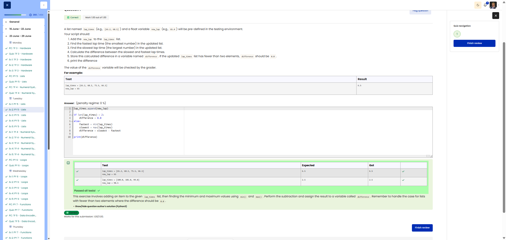

**Course:** Cyber Security Analyst - Python Basics | **Date:** 24 June 2025

---

## Task

**Objective:** Add a new lap time, find the fastest/slowest time and calculate the difference

**Requirements:**
- Lists: `lap_times` (predefined), `new_lap` (float, predefined)
- Return value: Variable `difference` (float)
- Steps: Add new time, find min/max, calculate difference and output
- Edge cases: Fewer than 2 elements → `difference = 0.0`

---

## Solution

```python
# 1. Add new lap time
lap_times.append(new_lap)

# 2-4. Calculate difference
if len(lap_times) < 2:
    difference = 0.0
else:
    fastest = min(lap_times)
    slowest = max (lap_times)
    difference = slowest - fastest

# 5. Print the difference
print(difference)
```

---

## Tests

| Input | Expected | Result | ✓ |
|-------|----------|----------|---|
| `lap_times = [65.2, 68.1, 71.5, 66.1]`<br>`new_lap = 65` | `6.5` | `6.5` | ✅ |
| `lap_times = []`<br>`new_lap = 65.0` | `0.0` | `0.0` | ✅ |

---

## Evidence

This evidence was added to the original solution structure. It documents the Cybersteps submission and keeps the original task, solution, tests, and notes intact.

The screenshot shows the passed Cybersteps check for appending a lap time and calculating the difference between the slowest and fastest lap.



## Notes

- **Concept:** `min()`, `max()`, list manipulation, edge case handling
- **Edge case:** With fewer than 2 elements, there is no meaningful difference
- **Alternative:** Sort the list instead of using `min()`/`max()` (less efficient)
