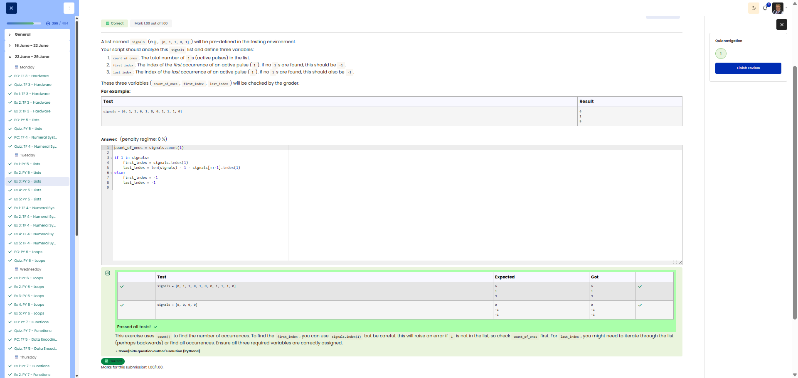

**Course:** Cyber Security Analyst - Python Basics | **Date:** 24 June 2025

---

## Task

**Objective:** Analyse a list of signals (0s and 1s) – find the number of 1s, and the first and last indices of the 1s

**Requirements:**
- List: `signals` (predefined, e.g. `[0, 1, 1, 0, 1]`)
- Variable 1: `count_of_ones` – number of 1s
- Variable 2: `first_index` – index of the first 1
- Variable 3: `last_index` - Index of the last 1
- Edge cases: No 1s present → `first_index = -1`, `last_index = -1`

---

## Solution

```python
# 1. Count the number of 1s
count_of_ones = signals.count(1)

# 2. Index of the first 1
if 1 in signals:
    first_index = signals.index(1)
else:
    first_index = -1

# 3. Index of the last 1
if 1 in signals:
    # Search from the end
    last_index = len(signals) - 1 - signals[::-1].index(1)
else:
    last_index = -1
```

---

## Tests

| Input | Expected | Result | ✓ |
|-------|----------|----------|---|
| `signals = [0, 1, 1, 0, 1, 0, 0, 1, 1, 1, 0]` | `count_of_ones = 6`<br>`first_index = 1`<br>`last_index = 9` | `6, 1, 9` | ✅ |
| `signals = [0, 0, 0]` | `count_of_ones = 0`<br>`first_index = -1`<br>`last_index = -1` | `0, -1, -1` | ✅ |

---

## Evidence

This evidence was added to the original solution structure. It documents the Cybersteps submission and keeps the original task, solution, tests, and notes intact.

The screenshot shows the passed Cybersteps check for count_of_ones, first_index, and last_index. The no-active-pulse case is also handled with -1.



## Notes

- **Concept:** `count()`, `index()`, list slicing with `[::-1]`
- **Tip:** Reverse the list for the last index and search from the front
- **Alternative:** Iterate from the back using a loop (more explicit)
