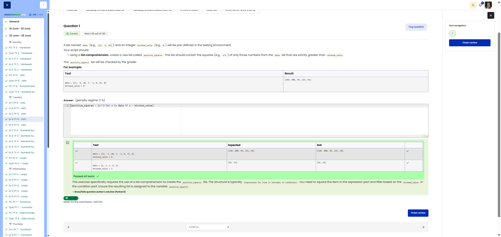

**Course:** Cyber Security Analyst - Python Basics | **Date:** 24 June 2025

---

## Task

**Objective:** Use list comprehension to calculate the squares of numbers greater than a minimum value

**Requirements:**
- Lists: `data` (predefined), `minimum_value` (int, predefined)
- Return value: List `positive_squares`
- Method: Use **list comprehension**
- Filter: Only numbers strictly greater than `minimum_value` (not equal to!)
- Edge cases: Empty list → empty result

---

## Solution

```python
# List comprehension: Squares of values > minimum_value
positive_squares = [x * x for x in data if x > minimum_value]
```

---

## Tests

| Input | Expected | Result | ✓ |
|-------|----------|----------|---|
| `data = [12, -5, 20, 7, -3, 0, 15, 8]`<br>`minimum_value = 0` | `[144, 400, 49, 225, 64]` | `[144, 400, 49, 225, 64]` | ✅ |
| `data = [1, 2, 3]`<br>`minimum_value = 5` | `[]` | `[]` | ✅ |
| `data = []`<br>`minimum_value = 0` | `[]` | `[]` | ✅ |

---

## Evidence

This evidence was added to the original solution structure. It documents the Cybersteps submission and keeps the original task, solution, tests, and notes intact.

The screenshot shows the passed Cybersteps check for the list comprehension that squares only values greater than minimum_value.



**Screenshots:**


## Notes

- **Concept:** List comprehension with a condition (`if`)
- **Syntax:** `[expression for element in list if condition]`
- **Important:** Use `>` not `>=` (strictly greater than)
- **Alternative:** Using a `for` loop and `append()` (less Pythonic)
