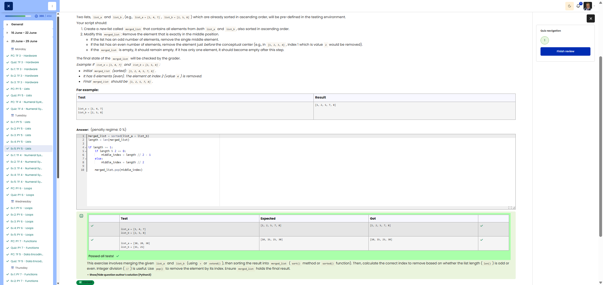

**Course:** Cyber Security Analyst - Python Basics | **Date:** 24 June 2025

---

## Task

**Objective:** Merge two sorted lists and remove the middle element

**Requirements:**
- Lists: `list_a`, `list_b` (both predefined and sorted)
- Return value: List `merged_list`
- Step 1: Merge both lists into a single sorted list
- Step 2: Remove the middle element
  - Odd number of elements: Middle element (index `len//2`)
  - Even number of elements: Element before the middle (index `len//2 - 1`)
- Edge cases: Empty list → remains empty; 1 element → becomes empty

---

## Solution

```python
# 1. Merge and sort the lists
merged_list = sorted(list_a + list_b)

# 2. Remove the middle element
if len(merged_list) > 0:
    # Calculate the index of the element to be removed
    if len(merged_list) % 2 == 1:
        # Odd: middle element
        middle_index = len(merged_list) // 2
    else:
        # Even: element before the middle
        middle_index = len(merged_list) // 2 - 1
    
    # Remove element
    del merged_list[middle_index]
```

---

## Tests

| Input | Expected | Result | ✓ |
|-------|----------|----------|---|
| `list_a = [1, 4, 7]`<br>`list_b = [2, 5, 8]` | ` [1, 2, 5, 7, 8]` | `[1, 2, 5, 7, 8]` | ✅ |
| `list_a = [1]`<br>`list_b = [2, 3]` | `[2, 3]` | `[2, 3]` | ✅ |
| `list_a = []`<br>`list_b = []` | `[]` | `[]` | ✅ |

---

## Evidence

This evidence was added to the original solution structure. It documents the Cybersteps submission and keeps the original task, solution, tests, and notes intact.

The screenshot shows the passed Cybersteps check for merging, sorting, and removing the middle element from the merged list.



**Screenshots:**


## Notes

- **Concept:** List concatenation using `+`, `sorted()`, `del`, modulo operation
- **Index calculation:** 
  - Odd (e.g. 5 elements): Index 2 (middle)
  - Even (e.g. 6 elements): Index 2 (before the middle)
- **Alternative:** `merged_list.pop(middle_index)` instead of `del`
