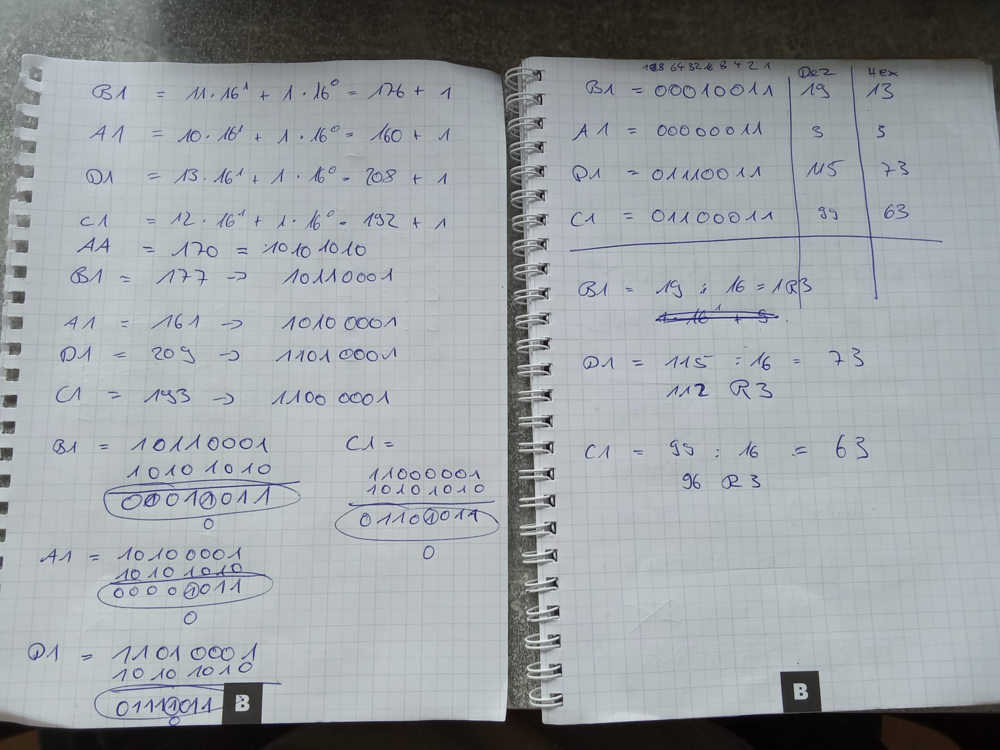
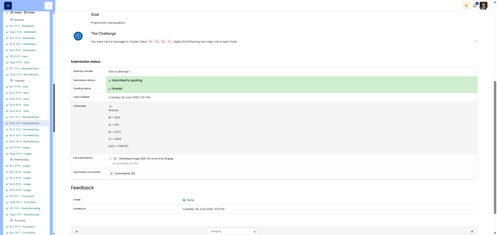

# 🖥️ Two-Step Transformation - Bit Manipulation

**Course:** Cyber Security Analyst - Technical Fundament Basics | **Date:** 25 June 2025

---

## Task

**Objective:** To practise bit manipulation using the XOR operation and targeted bit flipping

**Task:**
- Input: 4 bytes (hex): `B1`, `A1`, `D1`, `C1`
- Operation 1: Bitwise XOR with key `0xAA`
- Operation 2: Flip the 4th bit from the right (2³ = 8th position)
- Output: Resulting 4-byte sequence in hex

---

## Solution

### Environment
```
Method: Manual calculation using binary arithmetic
Tools: Hex-to-binary conversion, XOR table, bit manipulation
```

### Procedure

**Byte 1: 0xB1**

**Step 1:** XOR with 0xAA
```
B1 (hex) = 10110001 (binary)
AA (hex) = 10101010 (binary)

XOR (1 if different, 0 if the same):
  1 0 1 1 0 0 0 1
  1 0 1 0 1 0 1 0
  ---------------
  0 0 0 1 1 0 1 1 = 0x1B
```

**Step 2:** Flip the 4th bit from the right (2³ = bit at position 3)
```
0x1B = 00011011
Bit 3 (from the right, 0-indexed): Position 3 is 1
Flip: 1 → 0

  0 0 0 1 1 0 1 1
        ↓ (flip)
  0 0 0 1 0 0 1 1 = 0x13
```
**Result byte 1:** `0x13`

---

**Byte 2: 0xA1**

**Step 1:** XOR with 0xAA
```
A1 (hex) = 10100001 (binary)
AA (hex) = 10101010 (binary)

XOR:
  1 0 1 0 0 0 0 1
  1 0 1 0 1 0 1 0
  -------------- -
  0 0 0 0 1 0 1 1 = 0x0B
```

**Step 2:** Flip the 4th bit from the right
```
0x0B = 00001011
Bit 3: Position 3 is 1
Flip: 1 → 0

  0 0 0 0 1 0 1 1
        ↓ (flip)
  0 0 0 0 0 0 1 1 = 0x03
```
**Result byte 2:** `0x03`

---

**Byte 3: 0xD1**

**Step 1:** XOR with 0xAA
```
D1 (hex) = 11010001 (binary)
AA (hex) = 10101010 (binary)

XOR:
  1 1 0 1 0 0 0 1
  1 0 1 0 1 0 1 0
  -------------- -
  0 1 1 1 1 0 1 1 = 0x7B
```

**Step 2:** Flip the 4th bit from the right
```
0x7B = 01111011
Bit 3: Position 3 is 1
Flip: 1 → 0

  0 1 1 1 1 0 1 1
        ↓ (flip)
  0 1 1 1 0 0 1 1 = 0x73
```
**Result for byte 3:** `0x73`

---

**Byte 4: 0xC1**

**Step 1:** XOR with 0xAA
```
C1 (hex) = 11000001 (binary)
AA (hex) = 10101010 (binary)

XOR:
  1 1 0 0 0 0 0 1
  1 0 1 0 1 0 1 0
  -------------- -
  0 1 1 0 1 0 1 1 = 0x6B
```

**Step 2:** Flip the 4th bit from the right
```
0x6B = 01101011
Bit 3: Position 3 is 1
Flip: 1 → 0

  0 1 1 0 1 0 1 1
        ↓ (flip)
  0 1 1 0 0 0 1 1 = 0x63
```
**Result byte 4:** `0x63`

---

## Results

| Byte | Original | After XOR 0xAA | After bit flip | Final |
|------|------- ---|---------------|---------------|-------|
| 1 | 0xB1 | 0x1B | Bit 3: 1→0 | **0x13** |
| 2 | 0xA1 | 0x0B | Bit 3: 1→0 | **0x03** |
| 3 | 0xD1 | 0x7B | Bit 3: 1→0 | **0x73** |
| 4 | 0xC1 | 0x6B | Bit 3: 1→0 | **0x63** |

**Final 4-byte sequence: ** `13 03 73 63`

---

## Evidence

This evidence was added to the original solution structure. It documents the Cybersteps submission and keeps the original task, solution, tests, and notes intact.

The conversion notes show the binary, decimal, and hexadecimal transformations:

- `B1 = 0x13`
- `A1 = 0x03`
- `D1 = 0x73`
- `C1 = 0x63`
- ASCII result appears as `CRETXI?`



The platform screenshot shows the assignment submitted and graded as Done.



## Notes

- **Learned:** XOR operation, targeted bit flipping, multi-stage transformations
- **XOR properties:** A XOR B: bits different → 1, same → 0
- **Bit numbering:** Rightmost bit = bit 0 (LSB), 4th bit from the right = bit 3 (2³ = 8)
- **Bit flip:** Toggle a single bit using XOR with a mask (e.g. `XOR 00001000` for bit 3)
- **Alternative flip method:** `result XOR 0x08` (0x08 = 00001000) flips bit 3
- **Tip:** Python verification: `(0xB1 ^ 0xAA) ^ 0x08`
