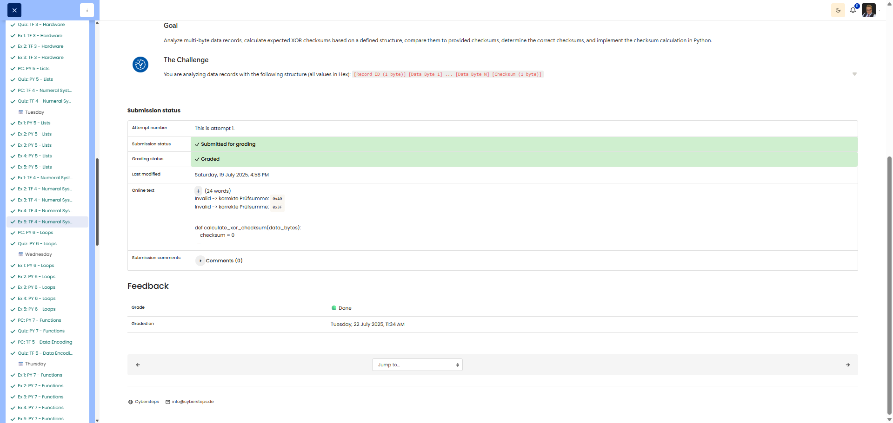

# 🖥️ Broken Record - XOR Checksum Validation

**Course:** Cyber Security Analyst - Technical Fundament Basics | **Date:** 25 June 2025

---

## Task

**Objective:** Analyse multi-byte data records, calculate and validate XOR checksums, create a Python implementation

**Task:**
- Record structure: `[Record ID] [Data Bytes...] [Checksum]`
- Checksum rule: XOR of all data bytes (excluding the Record ID)
- **Record A:** `1A 01 F0 AC 33 55 9B DD`
- **Record B:** `1B 22 4D 6F 81 B9 07 F5`
- Tasks: Validate, calculate correct checksums, implement Python function

---

## Solution

### Environment
```
Method: Manual XOR calculation + Python implementation
Tools: Hex-to-binary conversion, XOR operation, Python 3.x
```

### Procedure

---

## Record A: Manual Validation

**Record A:** `1A 01 F0 AC 33 55 9B DD`
- Record ID: `1A` (not included in checksum)
- Data Bytes: `01 F0 AC 33 55 9B`
- Provided Checksum: `DD`

**Step 1:** Conversion to binary
```
01 = 00000001
F0 = 11110000
AC = 10101100
33 = 00110011
55 = 01010101
9B = 10011011
```

**Step 2:** XOR all data bytes
```
     00000001  (01)
XOR  11110000  (F0)
    ---------
     11110001

XOR  10101100  (AC)
    ---------
     01011101

XOR  00110011  (33)
    ---------
     01101110

XOR  01010101  (55)
    ---------
     00111011

XOR  10011011  (9B)
    ------ ---
     10100000 = 0xA0
```

**Result:** Calculated checksum = `0xA0`

**Validation:** Provided `DD` ≠ Calculated `A0` → **INVALID**

**Correct Checksum:** `0xA0`

---

## Record B: Manual Validation

**Record B:** `1B 22 4D 6F 81 B9 07 F5`
- Record ID: `1B` (not included in checksum)
- Data Bytes: `22 4D 6F 81 B9 07`
- Provided Checksum: `F5`

**Step 1:** Conversion to binary
```
22 = 00100010
4D = 01001101
6F = 01101111
81 = 10000001
B9 = 10111001
07 = 00000111
```

**Step 2:** XOR all data bytes
```
     00100010  (22)
XOR  01001101  (4D)
    ---------
     01101111

XOR  01101111  (6F)
    ---------
     00000000

XOR  10000001  (81)
    ---------
     10000001

XOR  10111001  (B9)
    ---------
     00111000

XOR  00000111  (07)
    ---------
     00111111 = 0x3F
```

**Result:** Calculated checksum = `0x3F`

**Validation:** Provided `F5` ≠ Calculated `3F` → **INVALID**

**Correct Checksum:** `0x3F`

---

## Part 3: Python Implementation

```python
def calculate_xor_checksum(data_bytes):
    """
    Calculates the XOR checksum for a list of data bytes.
    
    Args:
        data_bytes: List of integers (0–255), e.g. [0x01, 0xF0, 0xAC]
    
    Returns:
        XOR checksum as an integer (0–255)
    """
    # Initial value for XOR is 0 (neutral element)
    checksum = 0
    
    # XOR all bytes one after the other
    for byte in data_bytes:
        checksum ^= byte
    
    return checksum


# Tests with Record A
record_a_data = [0x01, 0xF0, 0xAC, 0x33, 0x55, 0x9B]
result_a = calculate_xor_checksum(record_a_data)
print(f"Record A Checksum: 0x{result_a:02X}")  # 0xA0

# Tests with Record B
record_b_data = [0x22, 0x4D, 0x6F, 0x81, 0xB9, 0x07]
result_b = calculate_xor_checksum(record_b_data)
print(f"Record B Checksum: 0x{result_b:02X}")  # 0x3F

# Test with example from the task
test_data = [0x3F, 0x8A, 0x1C]
result_test = calculate_xor_checksum(test_data)
print(f"Test Checksum: 0x{result_test:02X}")  # 0xA9
print(f"Test Checksum (decimal): {result_test}")  # 169
```

---

## Results

### Manual Validation

| Record | Data Bytes | Provided Checksum | Calculated Checksum | Status | Correct Checksum |
|--------|------------|-------------------|--------- ------------|--------|------------------|
| **A** | `01 F0 AC 33 55 9B` | `DD` | `A0` | ❌ **Invalid** | **0xA0** |
| **B** | `22 4D 6F 81 B9 07` | `F5` | `3F` | ❌ **Invalid** | **0x3F** |

### Python Implementation

```python
def calculate_xor_checksum(data_bytes):
    checksum = 0
    for byte in data_bytes:
        checksum ^= byte
    return checksum
```

**Verification:**
- Record A: `calculate_xor_checksum([0x01, 0xF0, 0xAC, 0x33, 0x55, 0x9B])` → `0xA0` ✅
- Record B: `calculate_xor_checksum([0x22, 0x4D, 0x6F, 0x81, 0xB9, 0x07])` → `0x3F` ✅
- Example: `calculate_xor_checksum([0x3F, 0x8A, 0x1C])` → `0xA9` (169 decimal) ✅

---

## Evidence

This evidence was added to the original solution structure. It documents the Cybersteps submission and keeps the original task, solution, tests, and notes intact.

Checksum results:

- Invalid -> correct checksum: `0xA0`
- Invalid -> correct checksum: `0x3F`

```python
def calculate_xor_checksum(data_bytes):
    checksum = 0
    for byte in data_bytes:
        checksum ^= byte
    return checksum
```

The platform screenshot shows the assignment submitted and graded as Done.



**Screenshots:**


## Notes

- **Learned:** XOR checksum for error detection, multi-stage XOR calculation
- **XOR properties:**
  - Neutral element: `A XOR 0 = A`
  - Commutative: `A XOR B = B XOR A`
  - Associative: `(A XOR B) XOR C = A XOR (B XOR C)`
- **Purpose of checksum:** Detection of data corruption, not for security (not a hash!)
- **Limitation:** XOR checksum is weak (collisions possible), better: CRC, SHA
- **Record structure:** ID not included in checksum → only protect payload data
- **Python trick:** `^=` operator for accumulating XOR operation
- **Alternative:** `from functools import reduce; reduce(lambda a,b: a^b, data_bytes, 0)`
- **Format string:** `f"0x{value:02X}"` → 2-digit hex with leading 0
