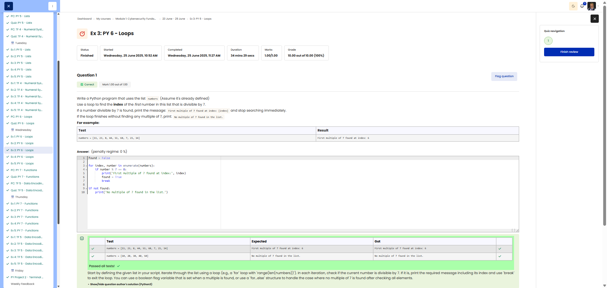

# 🐍 First Divisible by 7

**Course:** Cyber Security Analyst - Python Basics | **Date:** 26 June 2025

---

## Task

**Objective:** Find the index of the first number in a list that is divisible by 7

**Requirements:**
- List: `numbers` (predefined)
- Search: First number divisible by 7 (using `break`)
- Output if found: `"First multiple of 7 found at index: [index]"`
- Output if not found: `"No multiple of 7 found in the list."`
- Edge cases: Empty list or no multiples of 7

---

## Solution

```python
# Assumption: numbers is already defined
# numbers = [11, 23, 8, 44, 51, 68, 7, 21, 14]

found = False

for i in range(len(numbers)):
    if numbers[i] % 7 == 0:
        print(f"First multiple of 7 found at index: {i}")
        found = True
        break

if not found:
    print("No multiple of 7 found in the list.")
```

---

## Tests

| Input | Expected | Result | ✓ |
|-------|--------- -|----------|---|
| `numbers = [11, 23, 8, 44, 51, 68, 7, 21, 14]` | `First multiple of 7 found at index: 6` | `First multiple of 7 found at index: 6` | ✅ |
| `numbers = [1, 2, 3, 4, 5]` | `No multiple of 7 found in the list.` | `No multiple of 7 found in the list.` | ✅ |
| `numbers = [14, 3, 5]` | `First multiple of 7 found at index: 0` | `First multiple of 7 found at index: 0` | ✅ |

---

## Evidence

This evidence was added to the original solution structure. It documents the Cybersteps submission and keeps the original task, solution, tests, and notes intact.

The screenshot shows the passed Cybersteps check for finding the first value divisible by 7 and handling the no-match case.



**Screenshots:**


## Notes

- **Concept:** `for` loop with `break`, modulo operator `%`, flag variable
- **break:** Stops the loop immediately upon finding a match
- **Modulo:** `x % 7 == 0` checks for divisibility by 7
- **Alternative:** Use `enumerate()` for more elegant index iteration
