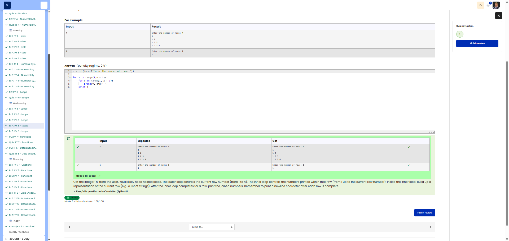

# 🐍 Number Triangle

**Course:** Cyber Security Analyst - Python Basics | **Date:** 26 June 2025

---

## Task

**Objective:** Print a number triangle with n rows, where row i contains the numbers 1 to i

**Requirements:**
- Input: Positive integer `n` (user input)
- Prompt: `"Enter the number of rows: "`
- Output: Triangle with n rows
- Format: Row i contains the numbers 1 to i, separated by spaces
- Edge Cases: n = 1 → only one row containing "1"

---

## Solution

```python
# User input
n = int(input("Enter the number of rows: "))

# Nested loop for triangle
for i in range(1, n + 1):
    # Print numbers from 1 to i
    row = []
    for j in range(1, i + 1):
        row.append(str(j))
    print(" ".join(row))
```

---

## Tests

| Input | Expected | Result | ✓ |
|-------|----------|----------|---|
| `4` | `Enter the number of rows: 4`<br>`1`<br>`1 2`<br>`1 2 3`<br>`1 2 3 4` | Correct | ✅ |
| `1` | `Enter the number of rows: 1`<br>`1` | `1` | ✅ |
| `3` | `1`<br>`1 2`<br>`1 2 3` | Correct | ✅ |

---

## Evidence

This evidence was added to the original solution structure. It documents the Cybersteps submission and keeps the original task, solution, tests, and notes intact.

The screenshot shows the passed Cybersteps check for printing a number triangle using nested loops.



## Notes

- **Concept:** Nested loops, `range()`, string manipulation
- **Outer loop:** Iterates over rows (1 to n)
- **Inner loop:** Generates numbers for the current row (1 to i)
- **Alternative:** `print(" ".join(str(j) for j in range(1, i + 1)))` (more compact)
