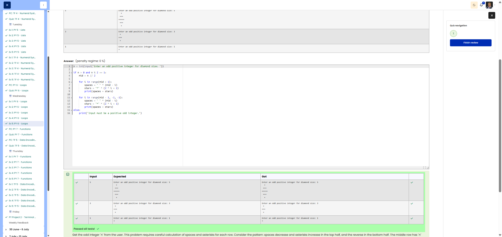

# 🐍 Diamond Pattern

**Course:** Cyber Security Analyst - Python Basics | **Date:** 26 June 2025

---

## Task

**Objective:** Create a centred diamond pattern made up of asterisks with height and width n

**Requirements:**
- Input: Odd positive integer `n` (user input)
- Prompt: `"Enter an odd positive integer for diamond size: "`
- Output: Diamond shape made of `*` with maximum width n
- Format: Centred with leading spaces
- Edge Cases: n = 1 → just a single `*`

---

## Solution

```python
# User input
n = int(input("Enter an odd positive integer for diamond size: "))

# Upper half (including centre)
for i in range(n // 2 + 1):
    spaces = " " * (n // 2 - i)
    stars = "*" * (2 * i + 1)
    print(spaces + stars)

# Lower half
for i in range(n // 2 - 1, -1, -1):
    spaces = " " * (n // 2 - i)
    stars = "*" * (2 * i + 1)
    print(spaces + stars)
```

---

## Tests

| Input | Expected | Result | ✓ |
|-------|----------|----------|---|
| `5` | `Enter an odd positive integer for diamond size: 5`<br>`  *`<br>` ***`<br>`*****`<br>` ***`<br>`  *` | Correct | ✅ |
| `3` | `Enter an odd positive integer for diamond size: 3`<br>` *`<br>`***`<br>` *` | Correct | ✅ |
| `1` | `Enter an odd positive integer for diamond size: 1`<br>`*` | `*` | ✅ |

---

## Evidence

This evidence was added to the original solution structure. It documents the Cybersteps submission and keeps the original task, solution, tests, and notes intact.

The screenshot shows the passed Cybersteps check for generating a star diamond with correct spaces and asterisks.



**Screenshots:**


## Notes

- **Concept:** Nested patterns, string multiplication, symmetry
- **Upper half:** Spaces decrease, stars increase
- **Lower half:** Mirrors the upper half (excluding the centre)
- **Formula:** Row i has `(n // 2 - i)` spaces and `(2 * i + 1)` stars
- **Alternative:** Single loop with condition for upper/lower half
