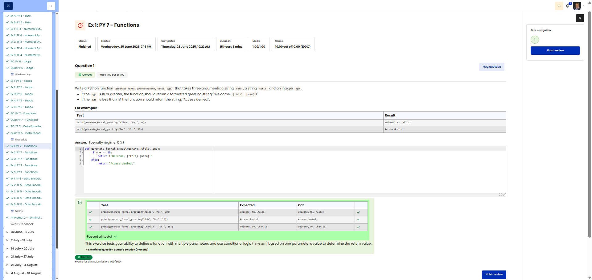

# 🐍 Formal Greeting Generator

**Course:** Cyber Security Analyst - Python Basics | **Date:** 27 June 2025

---

## Task

**Objective:** Create a function that generates a formal greeting based on the person’s age or denies access

**Requirements:**
- Function: `generate_formal_greeting(name, title, age)`
- Parameters: `name` (str), `title` (str), `age` (int)
- Return value: String
- Logic: Age >= 18 → Greeting, Age < 18 → "Access denied."
- Edge cases: Exactly 18 years old → Access granted

---

## Solution

```python
def generate_formal_greeting(name, title, age):
    """
    Generates a formal greeting based on age.
    
    Args:
        name: Person’s name (str)
        title: Person’s title (str)
        age: Person’s age (int)
    
    Returns:
        Greeting string or "Access denied."
    """
    if age >= 18:
        return f"Welcome, {title} {name}!"
    else:
        return "Access denied."
```

---

## Tests

| Input | Expected | Result | ✓ |
|-------|----------|----------|---|
| `generate_formal_greeting("Alice", "Mx.", 30)` | `"Welcome, Mx. Alice!"` | `"Welcome, Mx. Alice!"` | ✅ |
| `generate_formal_greeting("Bob", "Mr.", 17)` | `"Access denied."` | `"Access denied." ` | ✅ |
| `generate_formal_greeting("Charlie", "Dr.", 18)` | `"Welcome, Dr. Charlie!"` | `"Welcome, Dr. Charlie!"` | ✅ |

---

## Evidence

This evidence was added to the original solution structure. It documents the Cybersteps submission and keeps the original task, solution, tests, and notes intact.

The screenshot shows the passed Cybersteps check for a function with multiple parameters and an age-based return value.



**Screenshots:**


## Notes

- **Concept:** Conditional statements (`if/else`), string formatting with f-strings
- **Boundary case:** `age >= 18` means 18 is included
- **Alternative:** Ternary operator `return f"Welcome, {title} {name}!" if age >= 18 else "Access denied."`
