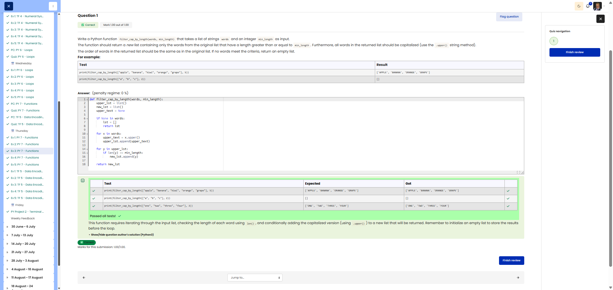

# 🐍 Filter and Capitalise by Length

**Course:** Cyber Security Analyst - Python Basics | **Date:** 27 June 2025

---

## Task

**Objective:** Filter words by minimum length and capitalise them

**Requirements:**
- Function: `filter_cap_by_length(words, min_length)`
- Parameters: `words` (list of strings), `min_length` (int)
- Return value: New list containing filtered and capitalised words
- Filter: Only words with length >= min_length
- Transformation: Capitalise all words (.upper())
- Edge cases: No matching words → empty list []

---

## Solution

```python
def filter_cap_by_length(words, min_length):
    """
    Filters words by minimum length and converts them to uppercase.
    
    Args:
        words: List of strings
        min_length: Minimum word length (int)
    
    Returns:
        New list containing filtered, uppercase words
    """
    result = []
    for word in words:
        if len(word) >= min_length:
            result.append(word.upper())
    
    return result
```

---

## Tests

| Input | Expected | Result | ✓ |
|-------|----------|----------|---|
| `filter_cap_by_length(["apple", "banana", "kiwi", "orange", "grape"], 5)` | `['APPLE', 'BANANA', 'ORANGE', 'GRAPE']` | `['APPLE', 'BANANA', 'ORANGE', 'GRAPE']` | ✅ |
| `filter_cap_by_length(["a", "b", "c"], 2)` | `[]` | `[]` | ✅ |
| `filter_cap_by_length(["test"], 4)` | `['TEST']` | `['TEST']` | ✅ |

---

## Evidence

This evidence was added to the original solution structure. It documents the Cybersteps submission and keeps the original task, solution, tests, and notes intact.

The screenshot shows the passed Cybersteps check for filtering words by minimum length and converting them to uppercase.



## Notes

- **Concept:** List filtering, string methods (`.upper()`), `len()`
- **Important:** Create a new list; do not modify the original
- **Order:** Retain the original order
- **Alternative (List Comprehension):** `return [word.upper() for word in words if len(word) >= min_length]`
