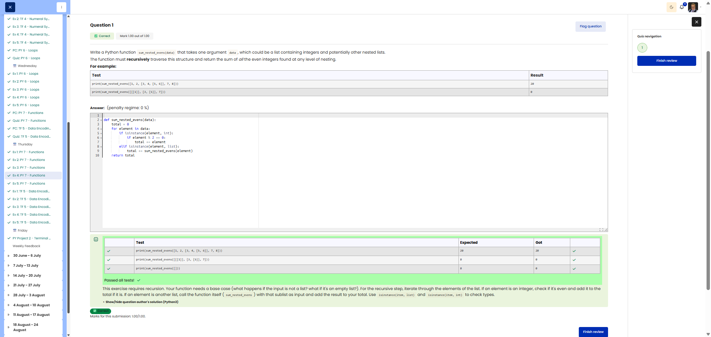

# 🐍 Sum Nested Evens (Recursion)

**Course:** Cyber Security Analyst - Python Basics | **Date:** 27 June 2025

---

## Task

**Objective:** Recursively calculate the sum of all even numbers in a nested list

**Requirements:**
- Function: `sum_nested_evens(data)`
- Parameter: `data` (list of integers and/or nested lists)
- Return value: Integer (sum of all even numbers)
- Method: **Recursion** (function calls itself)
- Edge cases: Only odd numbers → 0, empty list → 0

---

## Solution

```python
def sum_nested_evens(data):
    """
    Recursively calculates the sum of all even numbers in a nested list.
    
    Args:
        data: List of integers and/or nested lists
    
    Returns:
        Sum of all even numbers (int)
    """
    total = 0
    
    for item in data:
        if isinstance(item, list):
            # Recursive call for nested list
            total += sum_nested_evens(item)
        elif isinstance(item, int) and item % 2 == 0:
            # Even number found
            total += item
    
    return total
```

---

## Tests

| Input | Expected | Result | ✓ |
|-------|----------|----------|---|
| `sum_nested_evens([1, 2, [3, 4, [5, 6]], 7, 8])` | `20` | `20` | ✅ |
| `sum_nested_evens([[[1]], [3, [5]], 7])` | `0` | `0` | ✅ |
| `sum_nested_evens([2, 4, 6])` | `12` | `12` | ✅ |
| `sum_nested_evens([])` | `0` | `0` | ✅ |

---

## Evidence

This evidence was added to the original solution structure. It documents the Cybersteps submission and keeps the original task, solution, tests, and notes intact.

The screenshot shows the passed Cybersteps check for recursively traversing nested lists and summing even integers.



## Notes

- **Concept:** Recursion, `isinstance()`, modulo operator `%`
- **Recursion:** Function calls itself for nested lists
- **Base case:** Integer element is checked and added if applicable
- **Example:** [1, 2, [3, 4, [5, 6]], 7, 8] → 2 + 4 + 6 + 8 = 20
- **Alternative:** Iterative using a stack (more complex)
