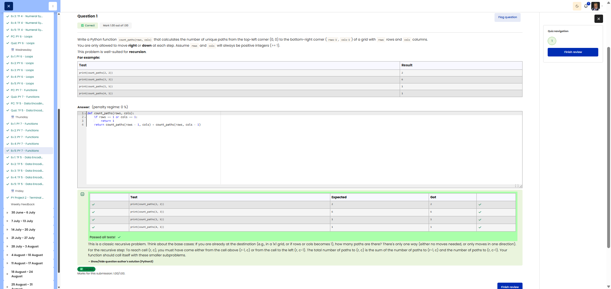

# 🐍 Count Grid Paths (Recursion)

**Course:** Cyber Security Analyst - Python Basics | **Date:** 27 June 2025

---

## Task

**Objective:** Recursively calculate the number of unique paths from the top left to the bottom right in a grid

**Requirements:**
- Function: `count_paths(rows, cols)`
- Parameters: `rows` (int), `cols` (int) - both >= 1
- Return value: Integer (number of unique paths)
- Movement: Only **right** or **down** allowed
- Method: **Recursion**
- Edge Cases: 1×n or n×1 grid → only 1 path possible

---

## Solution

```python
def count_paths(rows, cols):
    """
    Recursively calculates the number of distinct paths in a grid.
    
    Args:
        rows: Number of rows (int, >= 1)
        cols: Number of columns (int, >= 1)
    
    Returns:
        Number of unique paths from (0,0) to (rows-1, cols-1)
    """
    # Base cases: Only one row or one column
    if rows == 1 or cols == 1:
        return 1
    
    # Recursive case: sum of paths from the top and from the left
    # From the top: one cell down → rows-1 rows remain
    # From the left: one cell to the right → cols-1 columns remain
    return count_paths(rows - 1, cols) + count_paths(rows, cols - 1)
```

---

## Tests

| Input | Expected | Result | ✓ |
|-------|----------|----------|---|
| `count_paths(2, 2)` | `2` | `2` | ✅ |
| `count_paths(3, 3)` | `6` | `6` | ✅ |
| `count_paths(1, 5)` | `1` | `1` | ✅ |
| `count_paths(4, 1)` | `1` | `1` | ✅ |

---

## Evidence

This evidence was added to the original solution structure. It documents the Cybersteps submission and keeps the original task, solution, tests, and notes intact.

The screenshot shows the passed Cybersteps check for recursively calculating unique paths in a grid.



**Screenshots:**


## Notes

- **Concept:** Recursion, combinatorics, pathfinding
- **Logic:** paths(r, c) = paths(r-1, c) + paths(r, c-1)
- **Basis:** For 1×n or n×1, there is only one path (straight ahead)
- **Example:** 2×2 grid → 2 paths: right-down, down-right
- **Optimisation:** Add memoisation for larger grids (avoids recalculations)
