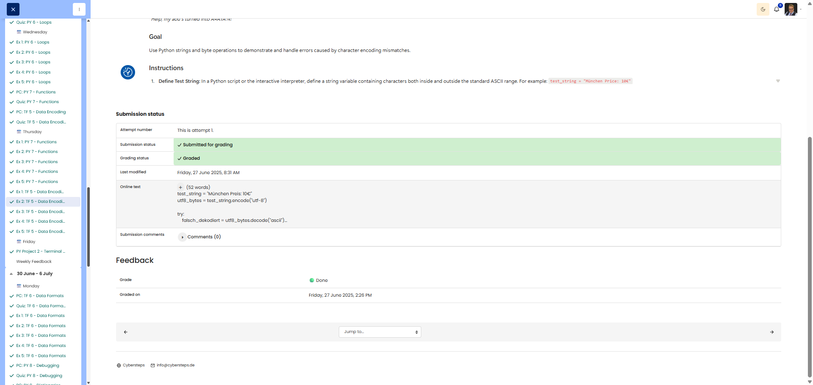

# 🖥️ Mismatch Mayhem - Encoding Errors

**Course:** Cyber Security Analyst - Technical Fundament Basics | **Date:** 27 June 2025

---

## Task

**Objective:** Demonstrate character encoding mismatches and implement error handling using Python

---

## Solution

## # Environment
```
Language: Python 3.x
Concept: String encoding/decoding, exception handling
```

### Implementation

**Python script: encoding_mismatch.py**

```python
# Step 1: Define test string
test_string = "Munich Price: 10€"
print(f"Original string: {test_string}")
print()

# Step 2: Correctly encode to UTF-8 bytes
utf8_bytes = test_string.encode('utf-8')
print(f"UTF-8 Encoded Bytes: {utf8_bytes}")
print(f"Hex Representation: {utf8_bytes.hex()}")
print()

# Step 3: Incorrect decoding with ASCII (try-except)
print("Attempting to decode UTF-8 bytes as ASCII...")
try:
    # Attempt with incorrect codec
    wrong_decode = utf8_bytes.decode('ascii')
    print(f"Decoded String: {wrong_decode}")
    
except UnicodeDecodeError as e:
    print(f"❌ Decoding FAILED!")
    print(f"Error: {e}")
    print(f"Reason: ASCII codec cannot decode bytes outside the 0x00-0x7F range.")
    print()

# Step 4: Correct decoding with UTF-8
print("Attempting to decode UTF-8 bytes as UTF-8...")
correct_decode = utf8_bytes.decode('utf-8')
print(f"✅ Decoded String: {correct_decode}")
print(f"Match with original: {correct_decode == test_string}")
print()

# Step 5: Explanation
print("=" * 60)
print("EXPLANATION: Why UnicodeDecodeError occurred")
print("=" * 60)
print("""
When we encode 'München Price: 10€' to UTF-8, characters like
'ü' and '€' are represented using multiple bytes with values > 127.

Example breakdown:
- 'ü' → UTF-8: 0xC3 0xBC (2 bytes)
- '€' → UTF-8: 0xE2 0x82 0xAC (3 bytes)

The ASCII codec only recognises single-byte values 0-127 (0x00-0x7F).
When it encounters byte 0xC3 (195 in decimal), which is > 127,
it raises a UnicodeDecodeError because this byte is invalid in ASCII.

Fundamental Conflict:
- ASCII: 7-bit encoding, supports only 128 characters (0-127)
- UTF-8: Variable-length encoding, uses bytes 128-255 for multi-byte
  sequences to represent characters beyond basic ASCII

Solution: Always decode using the same encoding that was used to encode!
""")
```

**Execution:**
```bash
python3 encoding_mismatch.py
```

---

## Results

**Console Output:**
```
Original String: München Price: 10€

UTF-8 Encoded Bytes: b'M\xc3\xbcnchen Price: 10\xe2\x82\xac'
Hex Representation: 4dc3bc6e6368656e2050726963653a2031309e282ac

Attempting to decode UTF-8 bytes as ASCII...
❌ Decoding FAILED!
Error: 'ascii' codec cannot decode byte 0xc3 at position 1: ordinal not in range(128)
Reason: ASCII codec cannot decode bytes outside the 0x00-0x7F range.

Attempting to decode UTF-8 bytes as UTF-8...
✅ Decoded String: München Price: 10€
Match with original: True
```

---

## Evidence

This evidence was added to the original solution structure. It documents the Cybersteps submission and keeps the original task, solution, tests, and notes intact.

```python
test_string = "München Preis: 10€"
utf8_bytes = test_string.encode("utf-8")

try:
    falsch_dekodiert = utf8_bytes.decode("ascii")
except UnicodeDecodeError:
    print("Die Dekodierung ist fehlgeschlagen: Falsche Zeichenkodierung verwendet (ascii statt utf-8).")

korrekt_dekodiert = utf8_bytes.decode("utf-8")
print("Erfolgreich dekodiert:", korrekt_dekodiert)
```

ASCII can only process 7-bit characters (`0-127`). UTF-8 uses byte values above 127 to represent special characters such as `ü` and `€`, so decoding UTF-8 bytes as ASCII fails.

The platform screenshot shows the assignment submitted and graded as Done.



**Screenshots:**


## Notes

- **Learned:** Encoding mismatches, try-except exception handling, UTF-8 vs ASCII
- **Causes of UnicodeDecodeError:**
  1. ASCII is 7-bit encoding (only values 0-127 are valid)
  2. UTF-8 multi-byte sequences use bytes ≥ 128 (0x80-0xFF)
  3. ASCII decoder stops with an error at bytes > 127
- **Example breakdown:**
  - 'M' → ASCII/UTF-8: `0x4D` ✅ (both the same)
  - 'ü' → UTF-8: `0xC3 0xBC` ❌ (ASCII cannot decode 0xC3)
  - '€' → UTF-8: `0xE2 0x82 0xAC` ❌ (all three bytes > 127)
- **Best Practice:** Always encode/decode using the same encoding
- **Error Handling:** `try-except UnicodeDecodeError` for robust programmes
- **Common Mistake:** "Mojibake" (文字化け) = incorrect encoding interpretation
  - Example: UTF-8 bytes read as Latin-1 → "München" instead of "München"
- **Python Bytes:** Prefix `b'...'` denotes a Bytes object
- **Hex Method:** `.hex()` converts Bytes to a hex string
