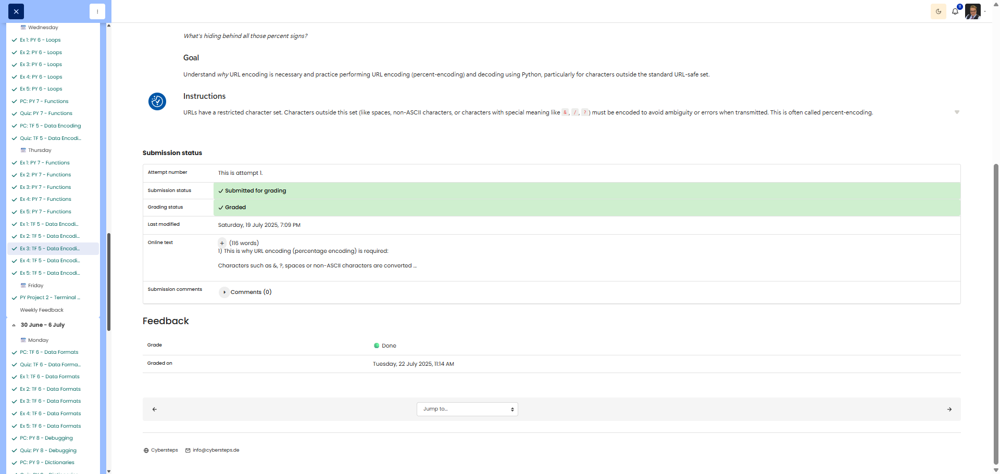

# 🖥️ URL Unraveling - Percent Encoding

**Course:** Cyber Security Analyst - Technical Fundament Basics | **Date:** 27 June 2025

---

## Task

**Objective:** Understand URL encoding (percent encoding) and practise it using Python

---

## Solution

### Environment
```
Language: Python 3.x
Modules: urllib.parse
Concept: URL encoding/decoding
```

### Procedure

**Step 1: Conceptual questions – Why URL encoding?**

**Example URL:** `https://example.com/search?category=shoes&color=blue`

**Problem 1: Special characters with specific meanings**
```
What if the search term itself contains an '&' or '?'?

Example without encoding:
  URL: /search?query=shoes&boots?

Problem: The server interprets:
  - '&' as a separator between parameters
  - '?' as the start of a new query string
  
Result: Ambiguity! The server cannot distinguish between:
  - Structural characters (part of the URL syntax)
  - Data characters (part of the search term)

Solution: Encoding!
  URL: /search?query=shoes%26boots%3F
  - %26 = '&' (encoded)
  - %3F = '?' (encoded)
```

**Problem 2: Spaces in URLs**
```
Spaces are problematic in URLs because:
1. The HTTP protocol uses spaces as separators
   Example: "GET /page.html HTTP/1.1"
   
2. Different systems interpret spaces differently
   
3. URLs should be "safe" for copy-paste

Solution:
  - Space → %20 (percent encoding)
  - Space → + (plus encoding, common in query strings)
```

---

**Step 2: URL Parameter Decoding**

**Given:** `https://example.com/search?query=M%C3%BCnchen+U-Bahn`

**Python Script:**
```python
from urllib.parse import unquote_plus

# Encoded query parameter
encoded_query = "M%C3%BCnchen+U-Bahn"

# Decode
decoded_query = unquote_plus(encoded_query)

print(f"Encoded: {encoded_query}")
print(f"Decoded: {decoded_query}")
```

**Output:**
```
Encoded: M%C3%BCnchen+U-Bahn
Decoded: München U-Bahn
```

**Explanation of the sequences:**

1. **`%C3%BC`** = 'ü'
   ```
   - UTF-8 bytes for 'ü': 0xC3 0xBC
   - URL encoding: Each byte → %XX
   - %C3 = first byte (195 decimal)
   - %BC = second byte (188 decimal)
   - Together: UTF-8 encoded 'ü'
   ```

2. **`+`** = Space
   ```
   - In query strings: '+' represents a space
   - Alternative: %20 (also valid for spaces)
   - Historical reason: Compactness in form data
   ```

**Original search query:** `Munich Underground`

---

**Step 3: String for URL encoding**

**Given:** `Price: 10€`

**Python script:**
```python
from urllib.parse import quote_plus

# Original string
original = "Price: 10€"

# URL encoding
encoded = quote_plus(original)

print(f"Original: {original}")
print(f"Encoded:  {encoded}")

# Byte-by-byte analysis
print("\nByte-by-byte breakdown:")
for char in original:
    encoded_char = quote_plus(char)
    print(f"  '{char}' → {encoded_char}")
```

**Output:**
```
Original: Price: 10€
Encoded:  Price%3A+10%E2%82%AC

Byte-by-byte breakdown:
  'P' → P
  'r' → r
  'e' → e
  'i' → i
  's' → s
  ':' → %3A
  ' ' → +
  '1' → 1
  '0' → 0
  '€' → %E2%82%AC
```

**URL-encoded string:** `Price%3A+10%E2%82%AC`

**Explanation:**
- `P`, `r`, `e`, `i`, `s`, `1`, `0`: URL-safe → no change
- `:` → `%3A` (colon has special meaning in URLs)
- ` ` → `+` (space)
- `€` → `%E2%82%AC` (UTF-8: E2 82 AC in hex)

---

## Results

| Question | Answer |
|-------|---------|
| **Conceptual questions** | |
| Why encode `&` and `?`? | These characters have structural significance in URLs (parameter separator, query start). Without encoding → ambiguity between syntax and data. |
| Why are spaces problematic? | 1) HTTP uses spaces as separators<br>2) Inconsistent interpretation<br>3) Not "safe" for copy-paste |
| **Decoding** | |
| Decoded query | `Munich Underground` |
| `%C3%BC` means | UTF-8 bytes for 'ü' (0xC3 0xBC) |
| `+` means | Space (in query strings) |
| **Encoding** | |
| Encoded String | `Price%3A+10%E2%82%AC` |

---

## Evidence

This evidence was added to the original solution structure. It documents the Cybersteps submission and keeps the original task, solution, tests, and notes intact.

URL encoding, also called percent encoding, is required because characters such as `&`, `?`, spaces, and non-ASCII characters can otherwise change the structure of a URL. A space can be encoded as `%20` or `+`, and `&` becomes `%26`. This keeps the URL structure intact and lets the server receive the intended data correctly.

Decoded text:

```text
München U-Bahn
```

Meaning of the encodings:

- `%C3%BC` represents `ü` in UTF-8. UTF-8 encodes `ü` as the bytes `0xC3 0xBC`, represented in a URL as `%C3` and `%BC`.
- `+` represents a space in `application/x-www-form-urlencoded` parameters.

Encoded result:

```text
Preis%3A+10%E2%82%AC
```

The platform screenshot shows the assignment submitted and graded as Done.



## Notes

- **Learned:** Necessity of URL encoding, percent encoding, UTF-8 in URLs
- **URL-safe characters:** A-Z, a-z, 0-9, `-`, `_`, `.`, `~`
- **Reserved Characters:** `:`, `/`, `?`, `#`, `[`, `]`, `@`, `!`, `$`, `&`, `'`, `(`, `)`, `*`, `+`, `,`, `;`, `=`
- **Encoding Methods:**
  - `quote()`: Standard percent encoding
  - `quote_plus()`: Same as `quote()`, but spaces → `+`
  - `unquote()`: Decodes %XX sequences
  - `unquote_plus()`: Decodes %XX and `+` → spaces
- **UTF-8 in URLs:** Multi-byte characters → multiple %XX sequences
- **Historical:** `+` for spaces from `application/x-www-form-urlencoded`
- **Modern:** `%20` preferred in paths, `+` OK in query strings
- **Security:** Always encode user input before constructing URLs!
