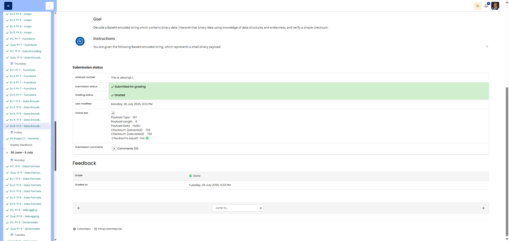

# 🖥️ The Payload - Base64 & Binary Data Analysis

**Course:** Cyber Security Analyst - Technical Fundament Basics | **Date:** 27 June 2025

---

## Task

**Objective:** Decode a Base64-encoded string, interpret the binary data structure and verify the checksum

---

## Solution

### Environment

```
Language: Python 3.x
Modules: base64, struct
Concepts: Base64 decoding, binary data parsing, checksum verification
```

### Implementation

**Given:** Base64 string `ALsGSGVsbG8hAtY=`

**Data structure (big-endian):**

- Payload Type: 16-bit unsigned int (2 bytes)
- Payload Length: 8-bit unsigned int (1 byte)
- Payload Data: ASCII string (variable length)
- Checksum: 16-bit unsigned int (2 bytes)

---

**Step 1: Base64 Decoding**

```python
import base64
import struct

# Base64 string
base64_string = "ALsGSGVsbG8hAtY="

# Decode
decoded_bytes = base64.decode(base64_string.encode('ascii'))

print(f"Base64 Input:  {base64_string}")
print(f"Decoded Bytes: {decoded_bytes.hex(' ').upper()}")
print(f"Decoded Bytes: {decoded_bytes}")
print(f"Total Length:  {len(decoded_bytes)} bytes")
print()
```

**Output:**

```
Base64 Input:  ALsGSGVsbG8hAtY=
Decoded Bytes: 00 BB 06 48 65 6C 6C 6F 21 02 D6
Decoded Bytes: b'\x00\xbb\x06Hello!\x02\xd6'
Total Length:  11 bytes
```

---

**Step 2: Binary Data Unpacking**

**Hex Breakdown:**

```
00 BB 06 48 65 6C 6C 6F 21 02 D6
│────│ │  │──────────────│ │────│
│    │ │  │              │ └────┴─ Checksum (2 bytes)
│    │ │  └──────────────┴──────── Payload Data (6 bytes)
│    │ └────────────────────────── Payload Length (1 byte)
└────┴──────────────────────────── Payload Type (2 bytes)
```

**Python Code:**

```python
# Payload Type: Bytes 0-1 (Big-Endian)
payload_type_bytes = decoded_bytes[0:2]
payload_type = struct.unpack('>H', payload_type_bytes)[0]
print(f"Payload Type (bytes): {payload_type_bytes.hex(' ').upper()}")
print(f"Payload Type (value): {payload_type}")
print()

# Payload Length: Byte 2
payload_length = decoded_bytes[2]
print(f"Payload Length (byte): {hex(payload_length).upper()}")
print(f"Payload Length (value): {payload_length}")
print()

# Payload Data: Bytes 3 to (3 + payload_length)
start_idx = 3
end_idx = 3 + payload_length
payload_data_bytes = decoded_bytes[start_idx:end_idx]
payload_data = payload_data_bytes.decode('ascii')
print(f"Payload Data (bytes): {payload_data_bytes.hex(' ').upper()}")
print(f"Payload Data (string): '{payload_data}'")
print()

# Checksum: Last 2 bytes (Big-Endian)
checksum_start = end_idx
checksum_bytes = decoded_bytes[checksum_start:checksum_start+2]
checksum_provided = struct.unpack('>H', checksum_bytes)[0]
print(f"Checksum (bytes): {checksum_bytes.hex(' ').upper()}")
print(f"Checksum (provided): {checksum_provided}")
print()
```

**Output:**

```
Payload Type (bytes): 00 BB
Payload Type (value): 187

Payload Length (byte): 0X6
Payload Length (value): 6

Payload Data (bytes): 48 65 6C 6C 6F 21
Payload Data (string): 'Hello!'

Checksum (bytes): 02 D6
Checksum (provided): 726
```

---

**Step 3: Checksum Verification**

**Checksum rule:** Sum of all bytes from Payload Type + Payload Length + Payload Data

```python
# Extract bytes for checksum calculation
checksum_fields_bytes = decoded_bytes[0:end_idx]
print(f"Bytes for checksum calculation: {checksum_fields_bytes.hex(' ').upper()}")
print(f"Individual bytes: {[f'{b:02X}' for b in checksum_fields_bytes]}")
print()

# Calculate checksum (sum of all byte values)
calculated_checksum = sum(checksum_fields_bytes)

print(f"Checksum Calculation:")
print(f"  Payload Type bytes:   {payload_type_bytes.hex(' ').upper()} → {sum(payload_type_bytes)}")
print(f"  Payload Length byte:  {hex(payload_length).upper()} → {payload_length}")
print(f"  Payload Data bytes:   {payload_data_bytes.hex(' ').upper()} → {sum(payload_data_bytes)}")
print()
print(f"  Total Sum: {sum(payload_type_bytes)} + {payload_length} + {sum(payload_data_bytes)}")
print(f"           = {calculated_checksum}")
print()

# Comparison
print("=" * 60)
print("CHECKSUM VERIFICATION")
print("=" * 60)
print(f"Calculated Checksum: {calculated_checksum}")
print(f"Provided Checksum:   {checksum_provided}")
print(f"Match: {calculated_checksum == checksum_provided}")
if calculated_checksum == checksum_provided:
    print("✅ Checksum is VALID!")
else:
    print("❌ Checksum is INVALID!")
```

**Detailed Calculation:**

```
Payload Type:   00 BB → 0 + 187 = 187
Payload Length: 06    → 6
Payload Data:   48 65 6C 6C 6F 21
                → 72 + 101 + 108 + 108 + 111 + 33 = 533

Total: 187 + 6 + 533 = 726
```

**Output:**

```
Checksum Calculation:
  Payload Type bytes:   00 BB → 187
  Payload Length byte:  0X6 → 6
  Payload Data bytes:   48 65 6C 6C 6F 21 → 533

  Total Sum: 187 + 6 + 533
           = 726

============================================================
CHECKSUM VERIFICATION
============================================================
Calculated Checksum: 726
Provided Checksum:   726
Match: True
✅ Checksum is VALID!
```

---

## Results

|Field|Bytes|Value|
|---|---|---|
|**Payload Type**|`00 BB`|**187** (decimal)|
|**Payload Length**|`06`|**6** (decimal)|
|**Payload Data**|`48 65 6C 6C 6F 21`|**"Hello!"**|
|**Checksum (provided)**|`02 D6`|**726** (decimal)|
|**Checksum (calculated)**|–|**726** (decimal)|
|**Checksums Match?**|–|✅ **YES**|

**Summary:**

- Base64 decoded to: `00 BB 06 48 65 6C 6C 6F 21 02 D6`
- Payload Type: 187
- Payload Length: 6
- Payload Data: "Hello!"
- Checksum: 726 (valid ✅)

---

## Evidence

This evidence was added to the original solution structure. It documents the Cybersteps submission and keeps the original task, solution, tests, and notes intact.

Parsed payload:

| Field | Value |
|---|---:|
| Payload Type | `187` |
| Payload Length | `6` |
| Payload Data | `Hello!` |
| Checksum (extracted) | `726` |
| Checksum (calculated) | `726` |
| Checksums equal? | `Yes` |

The platform screenshot shows the assignment submitted and graded as Done.



**Screenshots:**


## Notes

- **Learned:** Base64 decoding, binary protocol parsing, checksum verification
- **Base64:** Binary data → text (6 bits → 1 ASCII character)
    - Padding: `=` for alignment to 4-character blocks
    - Decode: `base64.b64decode()` or `.decode()`
- **Binary Parsing:** `struct.unpack()` for structured data
- **Checksum types:**
    - **Simple Sum:** Sum of all bytes (as used here)
    - **XOR:** XOR of all bytes
    - **CRC:** Cyclic Redundancy Check (more robust)
    - **Hash:** SHA, MD5 (cryptographic)
- **Big-Endian in network protocols:** Standard (RFC)
- **Payload Structure:** Type-Length-Value (TLV) pattern
    - Type: Identifies the data type
    - Length: Length of the data field
    - Value: The actual data
- **Checksum purpose:** Integrity check (not security!)
- **Python tips:**
    - `sum(bytes)` sums all byte values
    - `.decode('ascii')` for ASCII strings from bytes
    - `struct.unpack('>H', ...)` for 16-bit big-endian unsigned int
