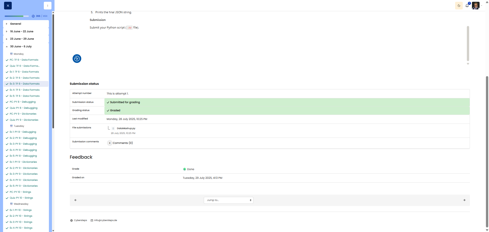

# 🖥️ Data Mashup – Combining JSON and CSV

**Course:** Cyber Security Analyst - Technical Fundament Basics | **Date:** 30 June 2025

---

## Task

**Objective:** Combine data from JSON and CSV into a single JSON output.

---

## Solution

### Python Script

```python
import json
import csv
from io import StringIO

# Source data
products_json_str = """
[
  {"id": "prod001", "name": " Wireless Mouse"},
  {"id": "prod002", "name": "USB Keyboard"},
  {"id": "prod003", "name": "24-inch Monitor"},
  {"id": "prod004", "name": "Webcam HD"}
]
"""

inventory_csv_str = """ProductID,Quantity,Warehouse
prod001,55,Main
prod003,12,West Wing
prod002,78,Main
prod004,30,Annex
"""

# 1. Parse JSON
products = json.loads(products_json_str)

# 2. Parse CSV
inventory = {}
reader = csv.DictReader(StringIO(inventory_csv_str))
for row in reader:
    inventory[row["ProductID"]] = {
        "quantity": int(row["Quantity"]),
        "warehouse": row["Warehouse"]
    }

# 3. Combine data
combined = []
for product in products:
    prod_id = product["id"]
    combined.append({
        "id": prod_id,
        "name": product["name"],
        "quantity": inventory[prod_id]["quantity"],
        "warehouse": inventory[prod_id]["warehouse"]
    })

# 4. Output as JSON
result = json.dumps(combined, indent=2)
print(result)
```

### Output

```json
[
  {
    "id": "prod001",
    "name": "Wireless Mouse",
    "quantity": 55,
    "warehouse": "Main"
  },
  {
    "id": "prod002",
    "name": "USB Keyboard",
    "quantity": 78,
    "warehouse": "Main"
  },
  {
    "id": "prod003",
    "name": "24-inch Monitor",
    "quantity": 12,
    "warehouse": "West Wing"
  },
  {
    "id": "prod004",
    "name": "Webcam HD",
    "quantity": 30,
    "warehouse": "Annex"
  }
]
```

---

## Evidence

Cybersteps shows the submitted Python file DataMashup.py as graded done. The submitted file is included here:

- [DataMashup.py](DataMashup.py)


---

## Notes

- **`json.loads()`:** Parses a JSON string into a Python object
- **`json.dumps(indent=2)`:** Formatted JSON output
- **`csv.DictReader()`:** Reads CSV as a list of dictionaries
- **`StringIO()`:** Treats a string as a file
- **Lookup dictionary:** Inventory as a dictionary for quick access by ID


