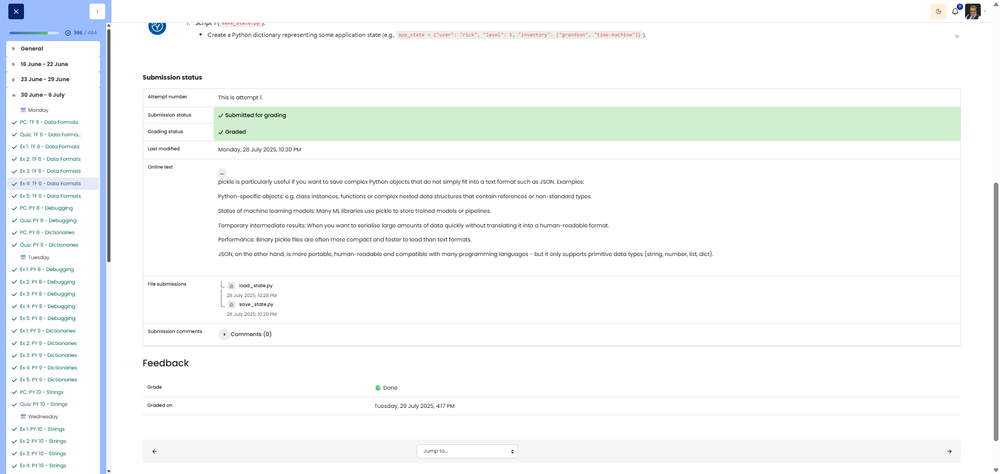

# 🖥️ Tasty Pickle - Saving/loading Python objects

**Course:** Cyber Security Analyst - Technical Fundament Basics | **Date:** 30 June 2025

---

## Task

**Objective:** Demonstrate the use of `pickle` to serialise and deserialise Python objects.

---

## Solution

### Script 1: save_state.py

```python
import pickle

# Create application state
app_state = {
    "user": "rick",
    "level": 5,
    "inventory": ["grandson", "time-machine"]
}

# Save to file (binary write)
with open("saved_state.pkl", "wb") as f:
    pickle.dump(app_state, f)

print("State saved.")
```

### Script 2: load_state.py

```python
import pickle

# Load from file (binary read)
with open("saved_state.pkl", "rb") as f:
    loaded_state = pickle.load(f)

# Display loaded data
print("Loaded state:", loaded_state)
print("User:", loaded_state["user"])
```

### Execution

```bash
$ python save_state.py
State saved.

$ python load_state.py
Loaded state: {'user': 'rick', 'level': 5, 'inventory': ['grandson', 'time-machine']}
User: rick
```

---

## Questions & Answers

**Q:** When is `pickle` more useful than JSON?

**A:** Pickle is useful when:
- **Complex Python objects** are being saved (classes, functions, nested structures)
- **Data types** need to be preserved (datetime, sets, tuples)
- **Only Python** needs to read the data (no interoperability required)
- **Performance** is important (pickle is faster than JSON)

JSON is better for interoperability with other languages and human-readable data.

---

## Evidence

Cybersteps shows the submitted save_state.py and load_state.py files as graded done. The submitted files are included here:

- [save_state.py](save_state.py)
- [load_state.py](load_state.py)

Pickle is particularly useful when complex Python objects need to be stored in a Python-specific format, for example class instances, functions, complex nested structures, machine-learning model states, or temporary intermediate results.

Binary pickle files are often compact and fast to load. JSON is more portable, human-readable, and language-independent, but it only supports primitive data types such as strings, numbers, lists, and dictionaries.


---

## Notes

- **`pickle.dump(obj, file)`:** Serialises object to file
- **`pickle.load(file)`:** Deserialises an object from a file
- **`"wb"` / `"rb"`:** Binary mode (write/read) required
- **⚠️ Security:** Never load pickle files from unknown sources!


