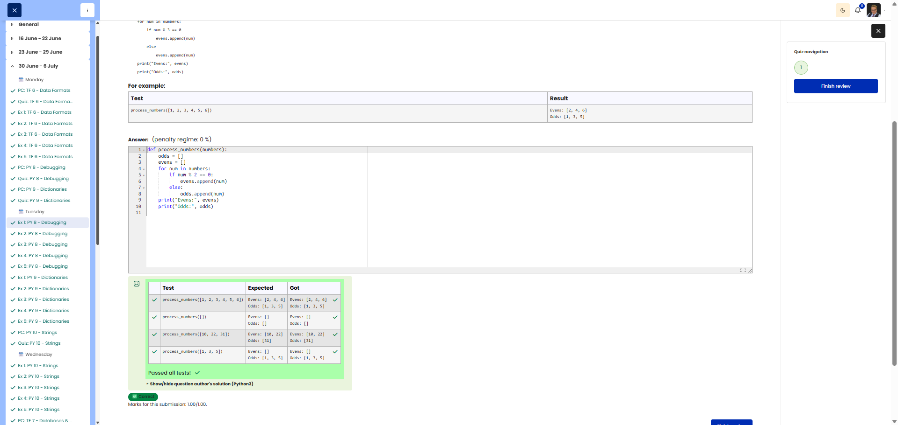

# 🐍 Process Numbers - Separate Even and Odd Numbers

**Course:** Cyber Security Analyst - Python Basics | **Date:** 01 July 2025

---

## Task

**Objective:** Split a list into even and odd numbers and print both lists.

**Requirements:**
- Function: `process_numbers(numbers)`
- Output: `print()` for Evens and Odds
- Edge Cases: Empty list → empty output

---

## Solution

```python
def process_numbers(numbers):
    odds = []
    evens = []
    for num in numbers:
        if num % 2 == 0:       # Fix: % 2 instead of % 3, colon
            evens.append(num)
        else:                   # Fix: colon added
            odds.append(num)    # Fix: odds instead of evens
    print("Evens:", evens)
    print("Odds:", odds)
```

---

## Evidence

Cybersteps shows the submitted solution as correct and all visible tests passed.


---

## Tests

| Input | Expected | Result | ✓ |
|-------|----------|----------|---|
| `[1, 2, 3, 4, 5, 6]` | Evens: [2, 4, 6], Odds: [1, 3, 5] | Evens: [2, 4, 6], Odds: [1, 3, 5] | ✅ |
| `[]` | Evens: [], Odds: [] | Evens: [], Odds: [] | ✅ |

---

## Notes

- **Error 1:** `% 3` → `% 2` (Modulo 2 checks for even/odd)
- **Error 2:** Missing `:` after `if` and `else`
- **Error 3:** In the `else` block, `evens` was assigned instead of `odds`


