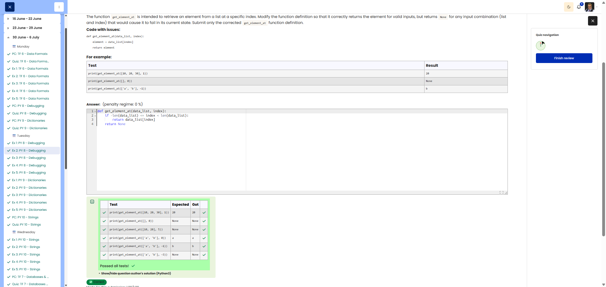

# 🐍 Get Element At - Sicherer Listenzugriff

**Course:** Cyber Security Analyst - Python Basics | **Date:** 01 July 2025

---

## Aufgabe

**Ziel:** Hole ein Element aus einer Liste an einem bestimmten Index. Bei ungültigem Zugriff `None` zurückgeben.

**Anforderungen:**
- Funktion: `get_element_at(data_list, index)`
- Rückgabe: Element oder `None`
- Edge Cases: Leere Liste, ungültiger Index → `None`

---

## Lösung

```python
def get_element_at(data_list, index):
    try:
        element = data_list[index]
        return element
    except (IndexError, TypeError):
        return None
```

---

## Evidence

Cybersteps shows the submitted solution as correct and all visible tests passed.


---

## Tests

| Input | Erwartet | Ergebnis | ✓ |
|-------|----------|----------|---|
| `([10, 20, 30], 1)` | 20 | 20 | ✅ |
| `([], 0)` | None | None | ✅ |
| `(['a', 'b'], -1)` | 'b' | 'b' | ✅ |

---

## Notizen

- **Konzept:** Exception Handling mit `try/except`
- **IndexError:** Wenn Index außerhalb der Liste liegt
- **TypeError:** Wenn `data_list` keine Liste ist oder `index` kein Integer
- **Negative Indizes:** `-1` gibt letztes Element zurück (Python-Feature)

