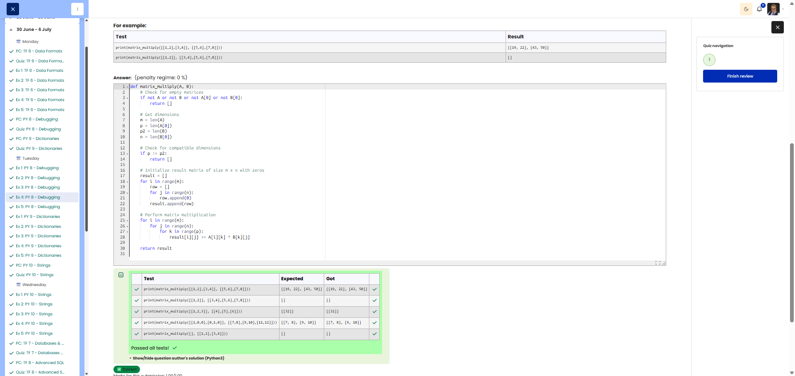

# 🐍 Matrix Multiply - Matrizenmultiplikation

**Course:** Cyber Security Analyst - Python Basics | **Date:** 01 July 2025

---

## Aufgabe

**Ziel:** Multipliziere zwei Matrizen A × B. Bei inkompatiblen Dimensionen leere Liste zurückgeben.

**Anforderungen:**
- Funktion: `matrix_multiply(A, B)`
- Rückgabe: Ergebnismatrix oder `[]`
- Edge Cases: Leere Matrix, inkompatible Dimensionen → `[]`

---

## Lösung

```python
def matrix_multiply(A, B):
    # Edge Cases prüfen
    if not A or not B:
        return []
    if not A[0] or not B[0]:
        return []
    
    m = len(A)       # Zeilen A
    p = len(A[0])    # Spalten A = Zeilen B
    p2 = len(B)      # Zeilen B
    n = len(B[0])    # Spalten B
    
    # Dimensionsprüfung VOR Initialisierung
    if p != p2:
        return []
    
    # Ergebnismatrix (m x n) initialisieren
    result = [[0 for _ in range(n)] for _ in range(m)]
    
    # Multiplikation: C[i][j] = Summe(A[i][k] * B[k][j])
    for i in range(m):
        for j in range(n):
            for k in range(p):
                result[i][j] += A[i][k] * B[k][j]
    
    return result
```

---

## Evidence

Cybersteps shows the submitted solution as correct and all visible tests passed.


---

## Tests

| Input | Erwartet | Ergebnis | ✓ |
|-------|----------|----------|---|
| `([[1,2],[3,4]], [[5,6],[7,8]])` | [[19, 22], [43, 50]] | [[19, 22], [43, 50]] | ✅ |
| `([[1,2]], [[3,4],[5,6],[7,8]])` | [] | [] | ✅ |

---

## Notizen

- **Fehler 1:** Keine Edge-Case-Prüfung für leere Matrizen
- **Fehler 2:** Dimensionsprüfung kam nach Initialisierung
- **Fehler 3:** Ergebnismatrix: `range(m)` × `range(n)`, nicht `range(p)` × `range(m)`
- **Fehler 4:** Indizes vertauscht: `A[i][k] * B[k][j]` statt `A[j][k] * B[k][i]`
- **Formel:** C[i][j] = Σ A[i][k] × B[k][j] für k = 0 bis p-1

