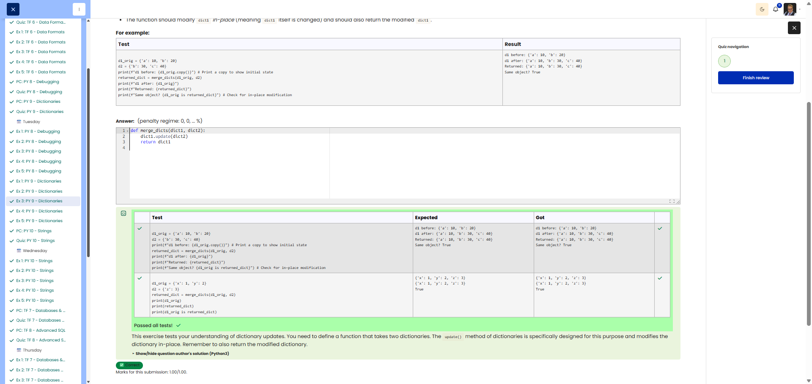

# 🐍 Merge Dicts - Merging Dictionaries

**Course:** Cyber Security Analyst - Python Basics | **Date:** 02 July 2025

## Task

**Goal:** Merge `dict2` into `dict1` (in-place). For identical keys, `dict2` overwrites. **Requirements:**

- Function: `merge_dicts(dict1, dict2)`
- Return: Modified `dict1`
- Important: **In-place** modification (no new dict)

---

## Solution

```python
def merge_dicts(dict1, dict2):
    """Merges dict2 into dict1 (in-place). dict2 overwrites on conflicts."""
    for key, value in dict2.items():
        dict1[key] = value
    return dict1
```

**Alternative (with .update()):**

```python
def merge_dicts(dict1, dict2):
    dict1.update(dict2)
    return dict1
```

---

## Evidence

Cybersteps shows the submitted solution as correct and all visible tests passed.


---

## Tests

|Test|Result|✓|
|---|---|---|
|`d1 = {'a': 10, 'b': 20}`|-|-|
|`merge_dicts(d1, {'b': 30, 'c': 40})`|`{'a': 10, 'b': 30, 'c': 40}`|✅|
|`d1 is returned_dict`|`True` (same object)|✅|

---

## Notes

- **In-place:** The original dict is modified, no new one is created
- **`.update()`:** Built-in method for dictionary merge
- **Overwriting:** For identical keys, `dict2` wins
- `is` vs == : is checks identity (same object), == checks value
