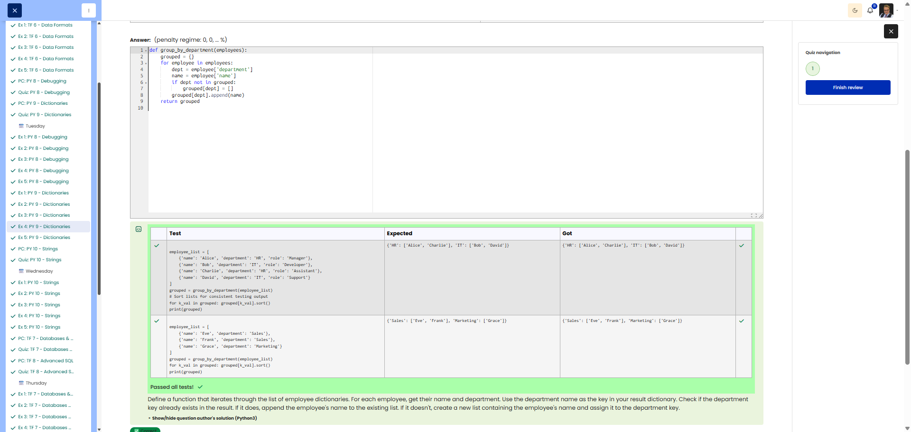

# 🐍 Group By Department - Group by department

**Course:** Cyber Security Analyst - Python Basics | **Date:** 02 July 2025

---

## Task

**Objective:** Group the list of employees by department.

**Requirements:**
- Function: `group_by_department(employees)`
- Input: List of dictionaries containing `'name'` and `'department'`
- Return: New dictionary `{department: [names]}`

---

## Solution

```python
def group_by_department(employees):
    """Groups employees by department."" "
    grouped = {}
    
    for employee in employees:
        dept = employee['department']
        name = employee['name']
        
        if dept not in grouped:
            grouped[dept] = []
        grouped[dept].append(name)
    
    return grouped
```

**Alternative (using .setdefault()):**
```python
def group_by_department(employees):
    grouped = {}
    for emp in employees:
        grouped.setdefault(emp['department'], []).append(emp['name'])
    return grouped
```

---

## Evidence

Cybersteps shows the submitted solution as correct and all visible tests passed.


---

## Tests

| Input | Expected | ✓ |
|-------|----------|---|
| `[{'name': 'Alice', 'department': 'HR'}, {'name': 'Bob', 'department': 'IT'}, {'name': 'Charlie', 'department': 'HR'}, {'name': 'David', 'department': 'IT'}]` | `{'HR': ['Alice', 'Charlie'], 'IT': ['Bob', 'David']}` | ✅ |
| `[]` | `{}` | ✅ |

---

## Notes

- **Concept:** Grouping with a dictionary
- **`.setdefault(key, default)`:** Returns a value, sets `default` if the key is missing
- **Alternative:** `collections.defaultdict(list)`
- **Access:** `dict['key']` raises an error if the key is missing, `dict.get('key')` returns `None`


